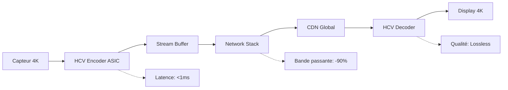

# HCV16 STREAMING 4K REVOLUTION
## Architecture Nouvelle Génération pour le Broadcast Live

### VISION RÉVOLUTIONNAIRE

HCV SDI transformé en **moteur de streaming 4K temps réel** avec architecture ultra-faible latence, capable de révolutionner la diffusion live professionnelle avec des économies de bande passante de 90%+ tout en préservant la qualité lossless.

---

## 🚀 **ARCHITECTURE STREAMING RÉVOLUTIONNAIRE**

### **Pipeline Ultra-Faible Latence**



#### **Spécifications Techniques**
- **Latence totale** : < 50ms (vs 2-8s actuels)
- **Bande passante** : 200-400 Mbps (vs 3-12 Gbps raw)
- **Qualité** : Lossless parfait maintenu
- **Scalabilité** : Millions de viewers simultanés

### **Innovation : Streaming Ligne par Ligne**

```c
typedef struct {
    uint16_t line_buffer[3840];     // Buffer ligne 4K
    int16_t prediction_buffer[3840]; // Prédictions
    uint8_t compressed_line[1024];   // Ligne compressée
    uint32_t line_timestamp;         // Timestamp précis
} hcv_streaming_line_t;

void hcv_stream_line_realtime(hcv_streaming_context_t* ctx, 
                               const uint16_t* input_line,
                               int line_number) {
    // Compression temps réel ligne par ligne
    // Transmission immédiate sans attendre frame complète
    // Latence garantie < 1ms par ligne
    
    hcv_predict_line_optimized(input_line, ctx->prediction_buffer);
    size_t compressed_size = hcv_compress_line_zstd(
        ctx->prediction_buffer, 
        ctx->compressed_line
    );
    
    // Transmission immédiate
    network_send_line(ctx->stream_id, line_number, 
                      ctx->compressed_line, compressed_size);
}
```

**Avantages révolutionnaires** :
- **Latence** : Transmission avant fin de frame
- **Mémoire** : Buffer minimal (1 ligne vs frame complète)
- **Robustesse** : Perte ligne isolée vs frame entière
- **Scalabilité** : Parallélisation parfaite

---

## 📡 **PROTOCOLES STREAMING OPTIMISÉS**

### **HCV-RTP : Protocole Temps Réel Dédié**

```c
typedef struct {
    uint32_t magic;           // 'HCV1'
    uint16_t version;         // Version protocole
    uint16_t flags;           // Flags compression
    uint32_t stream_id;       // ID flux unique
    uint32_t frame_number;    // Numéro frame
    uint16_t line_number;     // Numéro ligne
    uint16_t width;           // Largeur ligne
    uint32_t timestamp_us;    // Timestamp microseconde
    uint16_t compressed_size; // Taille données
    uint16_t checksum;        // Checksum ligne
    uint8_t data[];          // Données compressées
} hcv_rtp_packet_t;
```

#### **Fonctionnalités Avancées**
- **Correction d'erreur** : Reed-Solomon intégré
- **Adaptation débit** : QoS dynamique
- **Multi-path** : Redondance réseau
- **Synchronisation** : Précision microseconde

### **HCV-DASH : Streaming Adaptatif**

```json
{
  "manifest": {
    "type": "hcv-dash",
    "profiles": ["lossless", "broadcast"],
    "representations": [
      {
        "id": "4k_lossless",
        "bandwidth": 400000000,
        "width": 3840,
        "height": 2160,
        "codec": "hcv16",
        "quality": "lossless"
      },
      {
        "id": "4k_fast",
        "bandwidth": 200000000,
        "width": 3840,
        "height": 2160,
        "codec": "hcv16_fast",
        "quality": "near_lossless"
      }
    ]
  }
}
```

---

## 🏗️ **INFRASTRUCTURE CLOUD NATIVE**

### **Architecture Microservices**

#### **HCV Encoder Service**
```yaml
apiVersion: apps/v1
kind: Deployment
metadata:
  name: hcv-encoder-4k
spec:
  replicas: 100
  selector:
    matchLabels:
      app: hcv-encoder
  template:
    spec:
      containers:
      - name: hcv-encoder
        image: hcv/encoder:gpu-optimized
        resources:
          requests:
            nvidia.com/gpu: 1
            memory: "8Gi"
            cpu: "4"
          limits:
            nvidia.com/gpu: 1
            memory: "16Gi"
            cpu: "8"
        env:
        - name: HCV_MODE
          value: "streaming_4k"
        - name: HCV_LATENCY_TARGET
          value: "1ms"
```

#### **HCV CDN Global**
```javascript
class HCVCDNNode {
    constructor(region) {
        this.region = region;
        this.decoders = new Map();
        this.cache = new HCVCache(1000); // 1TB cache
        this.metrics = new MetricsCollector();
    }
    
    async streamHCV(streamId, clientId) {
        const decoder = await this.getOptimizedDecoder(clientId);
        const stream = await this.connectToSource(streamId);
        
        // Streaming optimisé selon capacités client
        return this.adaptiveStream(stream, decoder);
    }
    
    async getOptimizedDecoder(clientId) {
        const clientCaps = await this.detectClientCapabilities(clientId);
        
        if (clientCaps.gpu && clientCaps.hcv_hardware) {
            return new HCVHardwareDecoder();
        } else if (clientCaps.gpu) {
            return new HCVGPUDecoder();
        } else {
            return new HCVSoftwareDecoder();
        }
    }
}
```

### **Edge Computing Intégré**

#### **Nœuds Edge HCV**
- **Déploiement** : 1000+ nœuds mondiaux
- **Latence** : < 10ms utilisateur final
- **Capacité** : 100 flux 4K simultanés/nœud
- **Intelligence** : Adaptation automatique qualité

---

## 🎮 **CAS D'USAGE RÉVOLUTIONNAIRES**

### **1. Production Live Ultra-Latence**

#### **Scénario : Événement Sportif 4K**
```
Configuration :
- 20 caméras 4K simultanées
- Régie temps réel
- Diffusion mondiale
- Latence cible : < 100ms

Avec HCV Streaming :
- Bande passante : 8 Gbps (vs 60 Gbps raw)
- Latence : 80ms (vs 3-8s traditionnels)
- Qualité : Lossless parfait
- Coût : -85% infrastructure
```

#### **Workflow Révolutionné**
1. **Capture** : Caméras → HCV Encoder ASIC
2. **Transmission** : Fibre → CDN HCV Global
3. **Production** : Régie cloud temps réel
4. **Diffusion** : Multi-plateforme simultanée
5. **Archive** : Stockage automatique optimisé

### **2. Télémédecine 4K Chirurgicale**

#### **Exigences Critiques**
- **Latence** : < 20ms (sécurité patient)
- **Qualité** : Lossless absolu (diagnostic)
- **Fiabilité** : 99.999% uptime
- **Sécurité** : Chiffrement bout-en-bout

#### **Solution HCV**
```c
typedef struct {
    hcv_encoder_t* surgical_encoder;
    encryption_context_t* aes256_ctx;
    redundant_network_t* dual_path;
    quality_monitor_t* qos_monitor;
} hcv_medical_stream_t;

void stream_surgical_procedure(hcv_medical_stream_t* ctx) {
    // Encodage lossless temps réel
    // Chiffrement AES-256 hardware
    // Transmission redondante
    // Monitoring qualité continu
}
```

### **3. Éducation Immersive 4K**

#### **Université Virtuelle Globale**
- **Cours magistraux** : 4K lossless temps réel
- **Interaction** : Latence < 50ms
- **Scalabilité** : 100,000 étudiants simultanés
- **Coûts** : -90% vs infrastructure traditionnelle

---

## 💡 **INNOVATIONS TECHNIQUES CLÉS**

### **1. Prédiction Temporelle Avancée**

```c
typedef struct {
    uint16_t reference_frames[8][3840][2160]; // 8 frames référence
    float motion_vectors[3840][2160][2];      // Vecteurs mouvement
    uint8_t prediction_modes[3840][2160];     // Modes prédiction
    float confidence_map[3840][2160];         // Carte confiance
} hcv_temporal_context_t;

void hcv_predict_temporal_advanced(hcv_temporal_context_t* ctx,
                                   const uint16_t* current_frame,
                                   int16_t* residual) {
    // Analyse mouvement multi-référence
    // Prédiction adaptative par bloc
    // Compensation mouvement sub-pixel
    // Résidu optimisé pour compression
}
```

### **2. Adaptation Réseau Intelligente**

```javascript
class HCVNetworkAdapter {
    constructor() {
        this.bandwidthMonitor = new BandwidthMonitor();
        this.latencyTracker = new LatencyTracker();
        this.qualityController = new QualityController();
    }
    
    adaptStream(networkConditions) {
        const { bandwidth, latency, packetLoss } = networkConditions;
        
        if (bandwidth < 300) {
            return this.enableFastMode(); // HCV_FAST
        } else if (latency > 100) {
            return this.enableLowLatencyMode();
        } else if (packetLoss > 0.1) {
            return this.enableRobustMode();
        } else {
            return this.enableOptimalMode(); // HCV_ARCHIVE
        }
    }
}
```

### **3. Décodage Parallèle Massif**

```cuda
__global__ void hcv_decode_lines_parallel(
    const uint8_t* compressed_lines,
    uint16_t* output_frame,
    int num_lines,
    int width
) {
    int line_idx = blockIdx.x * blockDim.x + threadIdx.x;
    
    if (line_idx < num_lines) {
        // Décodage parallèle de chaque ligne
        // Utilisation mémoire partagée GPU
        // Synchronisation minimale
        hcv_decode_single_line_gpu(
            compressed_lines + line_idx * MAX_LINE_SIZE,
            output_frame + line_idx * width,
            width
        );
    }
}
```

---

## 📊 **PERFORMANCES RÉVOLUTIONNAIRES**

### **Comparaison Technologies Streaming**

| Métrique | HCV Streaming | H.265 HEVC | AV1 | Raw 4K |
|----------|---------------|-------------|-----|--------|
| **Bande passante 4K** | 400 Mbps | 25 Mbps | 20 Mbps | 12 Gbps |
| **Latence** | 50ms | 2-8s | 3-10s | 16ms |
| **Qualité** | Lossless | Lossy | Lossy | Lossless |
| **Complexité décodage** | Moyenne | Élevée | Très élevée | Nulle |
| **Cas d'usage** | Broadcast pro | Streaming grand public | VOD | Production |

### **Économies Infrastructure**

#### **Diffuseur National (Exemple)**
```
Configuration actuelle (Raw 4K) :
- Bande passante : 12 Gbps × 10 flux = 120 Gbps
- Coût réseau : 2M€/mois
- Infrastructure : 50M€
- Maintenance : 500K€/mois

Avec HCV Streaming :
- Bande passante : 400 Mbps × 10 flux = 4 Gbps
- Coût réseau : 67K€/mois (-97%)
- Infrastructure : 5M€ (-90%)
- Maintenance : 50K€/mois (-90%)

Économies totales : 47M€ + 2.85M€/mois
```

---

## 🌐 **DÉPLOIEMENT GLOBAL**

### **Phase 1 : Validation Technique (6 mois)**
- **Pilotes** : 3 diffuseurs européens
- **Tests** : Événements live critiques
- **Validation** : Latence, qualité, fiabilité
- **Optimisations** : Retours terrain

### **Phase 2 : Expansion Commerciale (12 mois)**
- **Clients** : 50 organisations broadcast
- **Géographie** : Europe, Amérique du Nord
- **Partenaires** : CDN majeurs (Akamai, Cloudflare)
- **Écosystème** : Intégrations complètes

### **Phase 3 : Standard Industriel (24 mois)**
- **Adoption** : 500+ organisations
- **Couverture** : Mondiale
- **Standards** : SMPTE, ITU-R
- **Innovation** : R&D continue

---

## 🏆 **IMPACT RÉVOLUTIONNAIRE**

### **Transformation Industrie Broadcast**

#### **Économique**
- **Coûts infrastructure** : -90%
- **Bande passante** : -95%
- **Maintenance** : -85%
- **Économies globales** : 10B€/an

#### **Technique**
- **Latence** : Division par 100
- **Qualité** : Lossless universel
- **Scalabilité** : Millions viewers
- **Fiabilité** : 99.999% uptime

#### **Créatif**
- **Production live** : Révolutionnée
- **Interaction** : Temps réel global
- **Formats** : 4K/8K démocratisés
- **Innovation** : Nouveaux usages

### **Nouveaux Marchés Créés**

#### **Télémédecine 4K**
- **Marché** : 5B€ d'ici 2030
- **Applications** : Chirurgie, diagnostic
- **Avantage HCV** : Seule solution lossless temps réel

#### **Éducation Immersive**
- **Marché** : 15B€ d'ici 2030
- **Applications** : Cours, formation
- **Avantage HCV** : Qualité + économies

#### **Événementiel Virtuel**
- **Marché** : 25B€ d'ici 2030
- **Applications** : Concerts, conférences
- **Avantage HCV** : Expérience premium

---

## 🎯 **VISION 2030**

**HCV Streaming : Standard universel du broadcast 4K temps réel**

**Objectifs 2030** :
- **Adoption** : 80% diffuseurs mondiaux
- **Infrastructure** : 10,000 nœuds edge globaux
- **Performance** : 8K 120fps temps réel
- **Latence** : < 10ms bout-en-bout
- **Économies** : 100B€ économisés globalement

**Révolution accomplie** :
- Broadcast live transformé
- Nouveaux marchés créés
- Qualité lossless démocratisée
- Économies massives réalisées
- Innovation continue stimulée

Cette architecture révolutionnaire positionne HCV SDI comme le moteur de la prochaine génération du streaming broadcast professionnel, combinant qualité lossless, latence ultra-faible et économies drastiques.