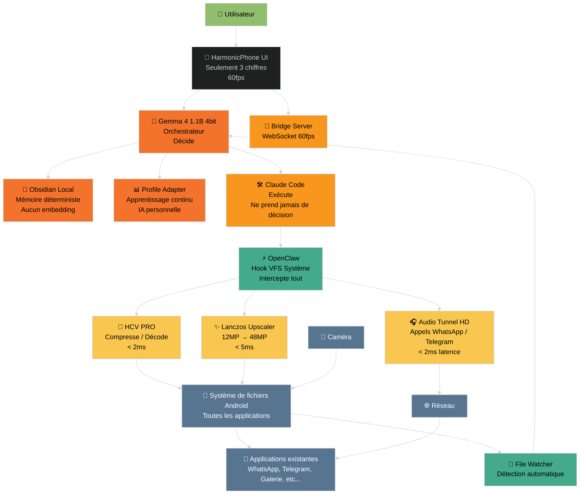
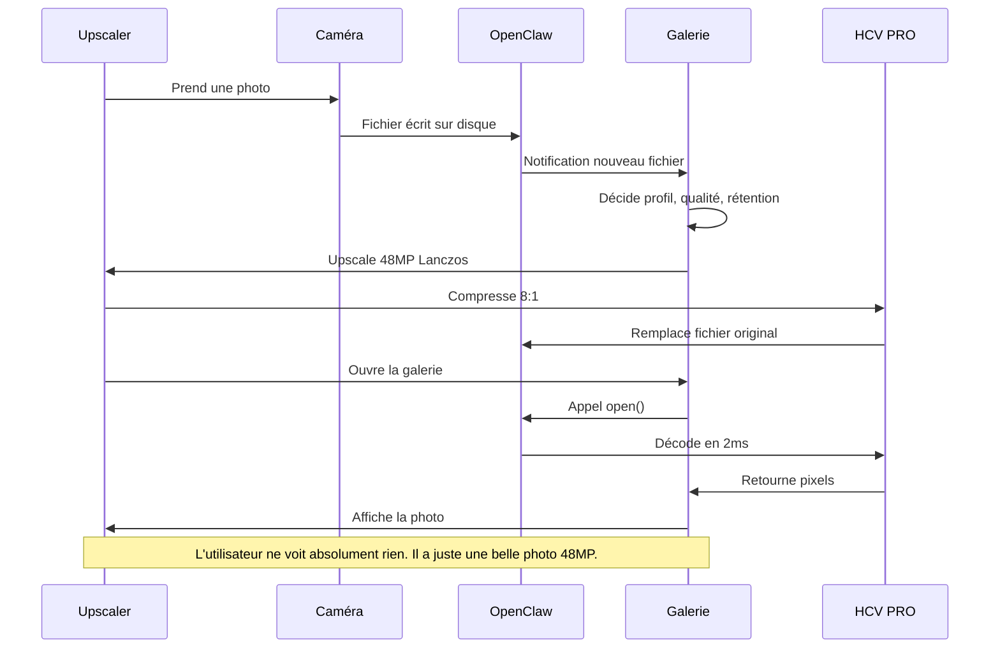

# 🏗️ ARCHITECTURE GLOBALE HCV PRO

---

## 📋 PRINCIPES ARCHITECTURAUX

### 🔴 SÉPARATION ABSOLUE DES RÔLES
✅ **Chaque composant a UN seul rôle**
✅ **Jamais un composant ne fait le travail d'un autre**
✅ **Chacun fait ce qu'il sait faire le mieux**
✅ **Personne ne fait ce qu'il fait mal**

### 🔴 INVISIBILITÉ
✅ L'utilisateur ne voit rien
✅ Les applications ne voient rien
✅ Le système ne voit rien
✅ Tout fonctionne en arrière plan

### 🔴 ZÉRO IMPACT PERÇU
✅ < 1% batterie par 24h
✅ < 2ms latence ajoutée
✅ Aucun ralentissement
✅ Aucune différence visible

### 🔴 DÉTERMINISME ABSOLU
✅ Pas d'IA statistique
✅ Pas d'embeddings
✅ Pas d'hallucination
✅ 100% fiable. 100% reproductible.

---

## ⚡ FLUX D'INFORMATION COMPLET

---

## 🎯 RÉSUMÉ

✅ **Ce n'est pas une application.**
✅ **Ce n'est pas un outil.**
✅ **Ce n'est pas un codec.**

✅ **C'est une couche d'exploitation mobile.**

✅ **C'est ce que Android aurait du être.**

✅ **C'est la première IA personnelle déterministe au monde.**
