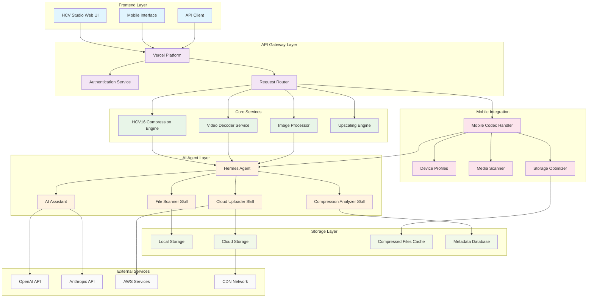
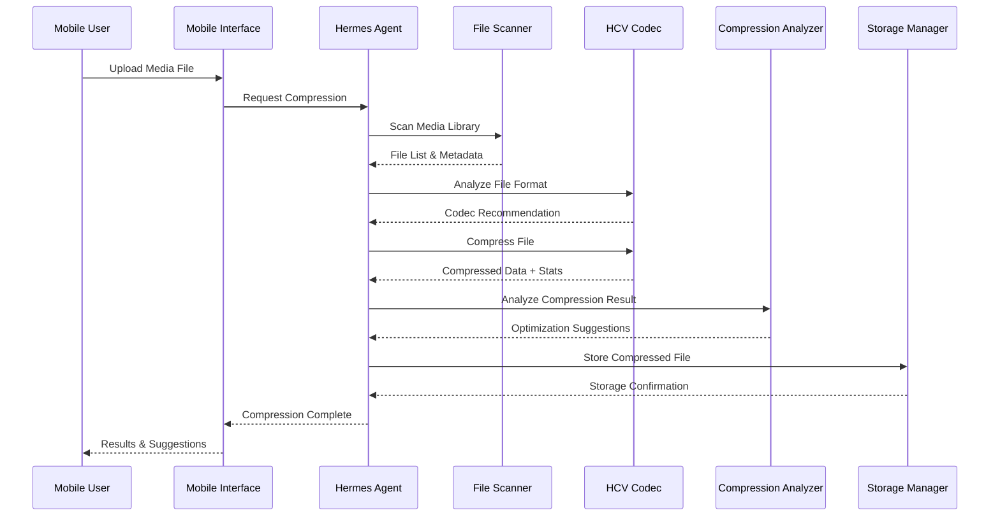
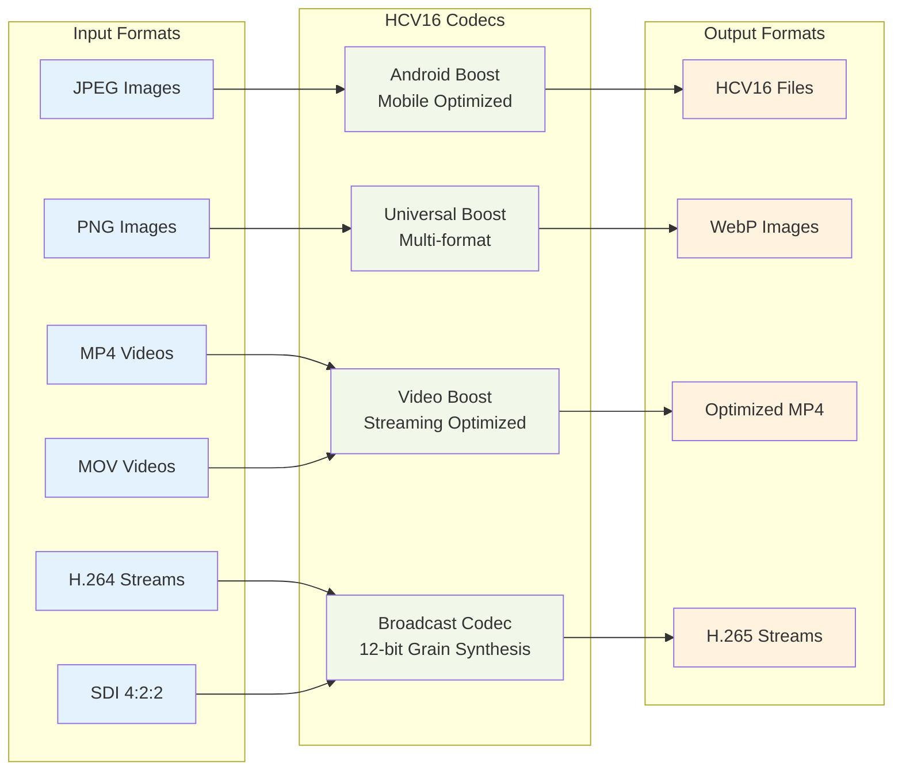
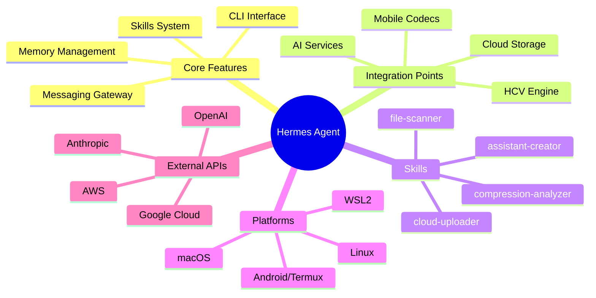
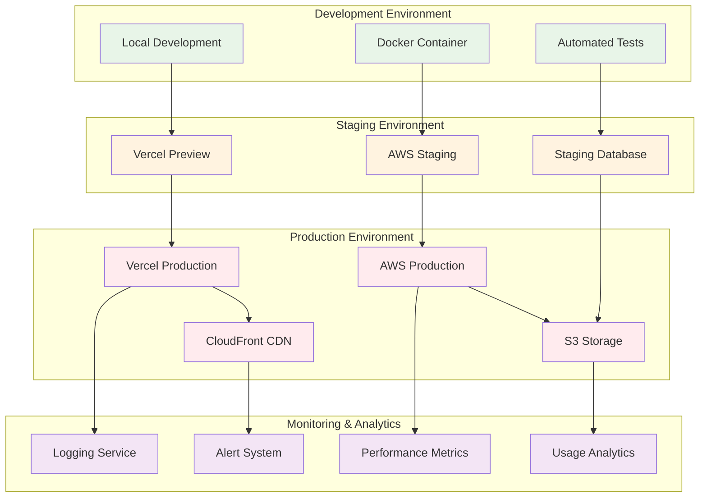
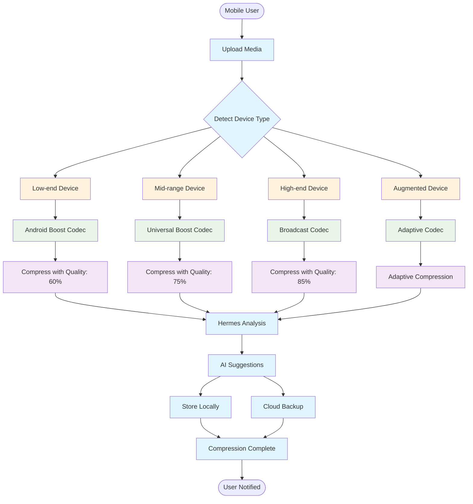
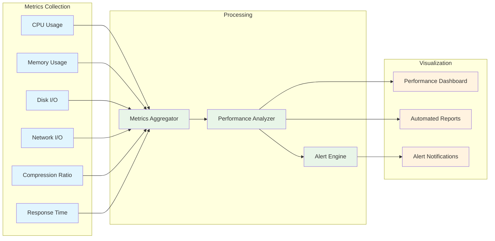

# HCV PRO - Architecture Diagramme Mermaid

## Vue d'Ensemble du Système

## Flux de Compression Mobile

## Architecture des Codecs HCV

## Intégration Hermes Agent

## Déploiement Cloud

## Flux de Données Mobile

## Architecture de Sécurité

```mermaid
graph TB
    subgraph "Security Layers"
        subgraph "Authentication"
            JWT[JWT Tokens]
            OAuth[OAuth 2.0]
            API_Keys[API Keys]
        end
        
        subgraph "Authorization"
            RBAC[Role-Based Access]
            Permissions[File Permissions]
            Rate_Limit[Rate Limiting]
        end
        
        subgraph "Data Protection"
            Encryption[Encryption at Rest]
            TLS[TLS in Transit]
            Hashing[Password Hashing]
        end
        
        subgraph "Monitoring"
            Audit_Logs[Audit Logs]
            Intrusion[Intrusion Detection]
            Anomaly[Anomaly Detection]
        end
    end

    subgraph "Protected Resources"
        API_Endpoints[API Endpoints]
        User_Data[User Data]
        Media_Files[Media Files]
        Config[Configuration]
    end

    JWT --> API_Endpoints
    OAuth --> User_Data
    API_Keys --> Media_Files
    
    RBAC --> API_Endpoints
    Permissions --> User_Data
    Rate_Limit --> Media_Files
    
    Encryption --> Config
    TLS --> API_Endpoints
    Hashing --> User_Data
    
    Audit_Logs --> API_Endpoints
    Intrusion --> Media_Files
    Anomaly --> User_Data

    classDef auth fill:#e3f2fd
    classDef authz fill:#e8f5e8
    classDef crypto fill:#fff3e0
    classDef monitor fill:#f3e5f5
    classDef resource fill:#ffebee
    
    class JWT,OAuth,API_Keys auth
    class RBAC,Permissions,Rate_Limit authz
    class Encryption,TLS,Hashing crypto
    class Audit_Logs,Intrusion,Anomaly monitor
    class API_Endpoints,User_Data,Media_Files,Config resource
```

## Performance Monitoring

---

## Légende

- **Bleu** : Frontend et interfaces utilisateur
- **Violet** : API et services de routage
- **Vert** : Moteurs de compression et traitement
- **Orange** : Agents IA et compétences
- **Rose** : Intégration mobile
- **Vert clair** : Stockage et persistance
- **Gris** : Services externes

Ces diagrammes illustrent l'architecture complète du système HCV PRO avec l'intégration Hermes Agent, montrant les flux de données, les dépendances et les interactions entre les différents composants.
