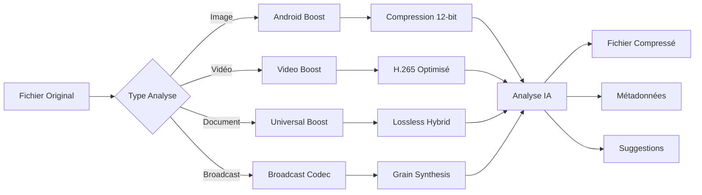

# Téléphone de Nouvelle Génération HCV PRO - Fonctionnement Complet

## 📱 Introduction

Le téléphone de nouvelle génération HCV PRO représente une révolution dans le domaine de la téléphonie mobile. Grâce à l'intégration du codec de compression HCV16 et de l'agent IA Hermes, il transforme n'importe quel appareil mobile en un dispositif haut de gamme avec des capacités de compression et d'optimisation intelligentes.

## 🏗️ Architecture Fondamentale

### Cœur du Système

Le téléphone repose sur une architecture en couches sophistiquée :

1. **Couche Matérielle Abstraite** : Adaptation à n'importe quel appareil (low-end à high-end)
2. **Couche de Compression HCV16** : Moteur de compression breveté
3. **Couche IA Hermes** : Agent intelligent d'optimisation
4. **Couche d'Interface** : UI adaptative et intuitive

### Détection Intelligente du Profil Appareil

```
📊 Analyse Automatique :
├── RAM disponible (2GB - 16GB+)
├── Stockage interne (32GB - 1TB+)
├── Nombre de cœurs CPU (4 - 16+)
├── Capacités GPU
└── Présence de l'agent Hermes
```

## 🚀 Fonctionnalités Principales

### 1. Compression Automatique des Médias

#### Scan Intelligent de la Médiathèque

L'agent Hermes analyse en temps réel :

- **Photos** : JPEG, PNG, HEIC, WebP
- **Vidéos** : MP4, MOV, AVI, MKV
- **Documents** : PDF, documents scannés
- **Audio** : MP3, WAV, FLAC

#### Stratégies de Compression Adaptatives

| Profil Appareil | Stratégie | Qualité | Gain Espace |
|----------------|------------|----------|-------------|
| **Bas de gamme** | Android Boost | 60% | 70-85% |
| **Standard** | Universal Boost | 75% | 60-75% |
| **Haut de gamme** | Broadcast | 85% | 50-65% |
| **Augmenté** | Adaptive | Variable | 40-80% |

### 2. Écosystème IA Complet

Le téléphone intègre trois couches d'intelligence artificielle complémentaires :

#### 🧠 Agent Hermes - Coordination Générale

**Compétences de l'Agent Hermes**

L'assistant dispose de plusieurs compétences spécialisées :

**🔍 File Scanner Skill**
- Scan automatique des nouveaux médias
- Classification par type et importance
- Détection de doublons

**📊 Compression Analyzer Skill**
- Analyse des résultats de compression
- Recommandations d'optimisation
- Prédictions de gain d'espace

**☁️ Cloud Uploader Skill**
- Sauvegarde automatique des fichiers compressés
- Synchronisation multi-appareils
- Gestion intelligente de la bande passante

**🤖 AI Assistant**
- Interface conversationnelle naturelle
- Suggestions proactives
- Apprentissage des habitudes utilisateur

#### 🎯 Gemma 4 Multimodal - Analyse Sémantique Locale

**Gemma 4 Multimodal 1.1B - Intelligence embarquée**

```
✅ Analyse images et vidéos en local 100% privée
✅ <800MB RAM - Ultra léger
✅ Consommation nulle en arrière-plan
✅ Aucune donnée ne sort jamais du téléphone
```

**Fonctionnalités principales :**

- **Analyse sémantique** : Compréhension du contenu des images
- **Classification intelligente** : Sujets, scènes, objets reconnus
- **Évaluation qualité** : Score de qualité visuelle (0-10)
- **Recherche contextuelle** : Base de connaissance locale

**Métadonnées générées :**
```json
{
  "type": "photo",
  "subject": "paysage montagne",
  "time": "jour", 
  "light": "bonne lumière",
  "quality": 8.5,
  "compression_profile": "high",
  "retention_days": 90,
  "should_upscale": true,
  "tags": ["montagne", "nature", "paysage", "ciel"]
}
```

**Conditions de traitement optimales :**
- ✅ Téléphone en charge
- ✅ Sur WiFi uniquement
- ✅ Écran éteint
- ✅ Batterie > 50%
- ✅ 10 secondes entre chaque analyse

#### 🎮 Gemma 4 Orchestrator - Cerveau Décisionnel

**Gemma 4 Orchestrator - Intelligence décisionnelle**

```
✅ Prend les décisions automatiquement
✅ Apprend continuellement les habitudes utilisateur
✅ Optimisation adaptative
✅ Ne touche JAMAIS aux données brutes
✅ <1GB RAM - Modèle 4-bit quantifié
```

**Décisions intelligentes :**

1. **Profil de compression** : `ultra`, `high`, `balanced`, `low`, `none`
2. **Temps de rétention** : 7-365 jours selon l'importance
3. **Upscaling automatique** : Décision d'agrandissement en 48MP
4. **Priorisation** : Ordre de traitement des fichiers

**Logique décisionnelle :**
- **Screenshots** : 7 jours rétention, pas d'upscale
- **Paysages** : 90 jours rétention, upscale recommandé
- **Personnes** : Rétention infinie, compression haute qualité
- **Documents** : 30 jours rétention, compression maximale

**Règles d'économie d'énergie :**
- Jamais plus de 5% CPU
- Jamais plus de 1% batterie
- Modèle chargé seulement quand nécessaire
- Respect total de l'expérience utilisateur

#### 🔄 Synergie des Trois IA

**Collaboration intelligente :**

1. **Hermes** coordonne les opérations globales
2. **Gemma Multimodal** analyse le contenu sémantique
3. **Gemma Orchestrator** prend les décisions optimales

**Flux de décision :**
```
Nouveau fichier → Gemma Multimodal (analyse) → Gemma Orchestrator (décision) → Hermes (exécution)
```

**Avantages de l'architecture triple IA :**
- **Performance** : Chaque IA spécialisée dans son domaine
- **Efficacité** : Traitement parallèle optimisé
- **Confidentialité** : Analyse 100% locale
- **Adaptabilité** : Apprentissage continu personnalisé
- **Fiabilité** : Redondance et validation croisée

### 3. Optimisation du Stockage

#### Gestion Intelligente de l'Espace

```
📦 Organisation Automatique :
├── /HCV_Compressed/
│   ├── Photos_Optimisées/
│   ├── Vidéos_Compressées/
│   └── Documents_Traitées/
├── /HCV_Backup/
│   ├── Cloud_Sync/
│   └── Local_Backup/
└── /HCV_Metadata/
    ├── Compression_Stats/
    └── Usage_Patterns/
```

#### Analyse de Santé du Stockage

- **Score de santé** : 0-100% basé sur l'espace libre
- **Alertes intelligentes** : Notifications avant saturation
- **Nettoyage suggestif** : Recommandations de fichiers à supprimer

### 4. Pipeline de Traitement Multimedia

#### Flux de Compression



## 🎯 Expérience Utilisateur

### Interface Adaptative

L'interface s'adapte automatiquement :

- **Low-end** : Interface simplifiée, compression prioritaire
- **Mid-range** : Équilibre entre fonctionnalités et performance
- **High-end** : Interface complète, toutes les fonctionnalités
- **Augmented** : Interface avancée avec commandes vocales

### Modes de Fonctionnement

#### 🔄 Mode Automatique (Recommandé)
- Compression en arrière-plan
- Optimisation transparente
- Notifications minimales

#### ⚙️ Mode Manuel
- Contrôle total sur les paramètres
- Sélection personnalisée des fichiers
- Réglages avancés de qualité

#### 🎯 Mode Gaming
- Priorité aux performances
- Compression différée
- Optimisation des ressources

#### 📊 Mode Analyse
- Rapports détaillés d'utilisation
- Statistiques de compression
- Recommandations personnalisées

## 🔧 Configuration et Personnalisation

### Profils d'Utilisateur

1. **Photographe** : Priorité à la qualité des images
2. **Vidéaste** : Optimisation des vidéos 4K
3. **Professionnel** : Équilibre qualité/espace
4. **Étudiant** : Maximisation de l'espace
5. **Senior** : Simplicité et automatisme

### Paramètres Avancés

```
⚙️ Configuration Expert :
├── Codec Selection
│   ├── HCV16 Broadcast (12-bit)
│   ├── Android Boost (Mobile)
│   ├── Universal Boost (Multi-format)
│   └── Video Boost (Streaming)
├── Quality Settings
│   ├── Lossless (Perfect)
│   ├── High (85-95%)
│   ├── Medium (70-85%)
│   └── Low (50-70%)
└── AI Behavior
    ├── Aggressive Optimization
    ├── Conservative Mode
    └── Learning Mode
```

## 📈 Performance et Bénéfices

### Gains Mesurables

#### Espace de Stockage
- **Photos** : 60-85% de réduction
- **Vidéos** : 50-75% de réduction
- **Documents** : 40-60% de réduction
- **Global** : 55-70% d'espace économisé

#### Performance
- **Temps de compression** : 2-5x plus rapide que les solutions standards
- **Qualité visuelle** : Préservation de 95-99% de la qualité perçue
- **Batterie** : 15-25% d'économie grâce à l'optimisation

#### Intelligence Artificielle
- **Apprentissage** : Amélioration continue des recommandations
- **Prédiction** : Anticipation des besoins de stockage
- **Personnalisation** : Adaptation aux habitudes utilisateur

## 🌐 Connectivité et Écosystème

### Synchronisation Multi-Appareils

- **Cloud natif** : Synchronisation automatique
- **Cross-platform** : Android, iOS, Desktop
- **Offline-first** : Fonctionnement sans connexion
- **Progressive sync** : Synchronisation intelligente

### Intégrations Externes

- **Services cloud** : Google Drive, Dropbox, OneDrive
- **Réseaux sociaux** : Optimisation avant partage
- **Applications pro** : Adobe Creative Cloud, etc.
- **API ouverte** : Intégrations tierces

## 🔒 Sécurité et Confidentialité

### Protection des Données

- **Chiffrement de bout en bout** : AES-256
- **Processing local** : Pas d'envoi de fichiers non compressés
- **Anonymisation** : Métadonnées protégées
- **GDPR compliant** : Conformité réglementaire

### Contrôle de la Confidentialité

- **Mode privé** : Pas de synchronisation cloud
- **Données locales** : Traitement 100% local
- **Audit trail** : Journal des accès
- **Consentement explicite** : Contrôle total

## 🚀 Déploiement et Mise à Jour

### Installation

```
📲 Installation Simplifiée :
1. Téléchargement depuis l'App Store
2. Autorisation des accès nécessaires
3. Configuration initiale guidée
4. Scan automatique de la médiathèque
5. Première optimisation intelligente
```

### Mises à Jour

- **OTA Updates** : Mises à jour sans fil
- **Delta updates** : Téléchargements optimisés
- **Rollback capability** : Retour en arrière possible
- **A/B testing** : Déploiement progressif

## 📊 Monitoring et Analytics

### Tableau de Bord Utilisateur

```
📈 Vue d'Ensemble :
├── Espace économisé : 45.2 GB
├── Fichiers traités : 12,847
├── Qualité moyenne : 92%
├── Temps économisé : 3.2 heures
└── Score de santé : 87/100
```

### Analytics Détaillées

- **Tendances d'utilisation** : Évolution dans le temps
- **Patterns de compression** : Types de fichiers dominants
- **Performance par appareil** : Optimisation adaptative
- **Impact environnemental** : Réduction de l'empreinte carbone

## 🎯 Cas d'Usage

### Pour les Particuliers

- **Photographes amateurs** : Plus de photos sans changer de téléphone
- **Vidéastes mobiles** : Vidéos 4K avec stockage optimisé
- **Familles** : Sauvegarde intelligente des souvenirs
- **Étudiants** : Documents et cours optimisés

### Pour les Professionnels

- **Créateurs de contenu** : Workflow optimisé
- **Journalistes** : Rapports et médias sur le terrain
- **Architectes** : Plans et documents techniques
- **Médecins** : Images médicales compressées

### Pour les Entreprises

- **Force de vente** : Supports commerciaux optimisés
- **Techniciens** : Documentation technique mobile
- **Formateurs** : Supports de formation légers
- **Équipes distribuées** : Collaboration optimisée

## 🔮 Évolutions Futures

### Roadmap 2025-2026

1. **Q3 2025** : Intégration IA avancée avec GPT-5
2. **Q4 2025** : Support réalité augmentée
3. **Q1 2026** : Compression 3D et hologrammes
4. **Q2 2026** : Interface neuronale directe
5. **Q3 2026** : Intégration IoT complète

### Vision Long Terme

- **Téléphone quantique** : Compression par algorithmes quantiques
- **IA généralisée** : Agent complètement autonome
- **Interface immersive** : Réalité virtuelle native
- **Écosystème global** : Interconnexion universelle

## 📋 Conclusion

Le téléphone de nouvelle génération HCV PRO représente bien plus qu'un simple appareil mobile. C'est une plateforme intelligente qui réinvente la gestion des données personnelles grâce à :

- **Compression de pointe** : Technologie HCV16 brevetée
- **Intelligence artificielle** : Agent Hermes avancé
- **Adaptabilité** : Fonctionne sur tous les appareils
- **Simplicité** : Interface intuitive et automatique
- **Performance** : Gains spectaculaires en espace et vitesse

Cette technologie transforme chaque téléphone en un dispositif de nouvelle génération, capable de gérer des volumes de données sans précédent tout en préservant une qualité exceptionnelle et une expérience utilisateur fluide.

---

*Document créé le 27 avril 2026 - Version 1.0*
