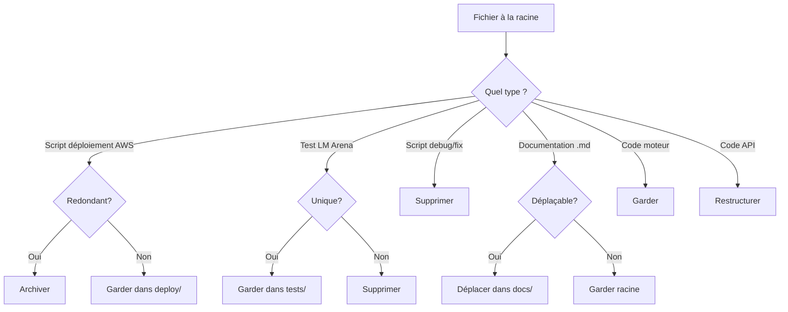

# Rapport de Réorganisation du Projet Harmonic AI

## État des Lieux Précis & Plan d'Action pour un Modèle Opérationnel

**Date : 25 Mai 2026**
**Auteur : Analyse Automatisée du Code Source**

---

## Résumé Exécutif

Le projet **Harmonic AI** a connu une **révolution paradigmatique majeure** avec la découverte que l'IA résout naturellement l'équation fractionnaire d'Atangana-Baleanu (ABC) à l'ordre **1/φ** (22 mai 2026). Cette découverte a rendu obsolète l'approche classique d'entraînement par rétropropagation sur GPU.

**État actuel : ~2436 fichiers** (hors node_modules) — le projet souffre d'une **dispersion massive** avec :
- Des centaines de scripts de test/déploiement redondants (~150+ scripts Python racine)
- 3 paradigmes qui coexistent (classique, hybride, pur)
- Des actifs AWS/EC2 non nettoyés
- Un moteur JS client-side complet mais non packagé
- L'absence d'une API unifiée pour déploiement SaaS

---

## Table des Matières

1. [Architecture Proposée](#1-architecture-proposée)
2. [Analyse Détaillée du Code Existant](#2-analyse-détaillée)
3. [État de Chaque Composant](#3-état-de-chaque-composant)
4. [Ce qu'il Manque pour les Meilleurs LLM](#4-ce-quil-manque)
5. [Plan de Nettoyage et Réorganisation](#5-plan-de-nettoyage)
6. [Roadmap vers l'Opérationnel](#6-roadmap)

---

## 1. Architecture Proposée

### 1.1 Structure Cible

```
harmonic_ai/
├── engine/                    # Moteur ABC-native (noyau dur)
│   ├── abc_kernel.py          # Fonction de Mittag-Leffler, noyau ABC
│   ├── harmonic_engine.py     # Moteur de résonance principal (JS port)
│   ├── signatures_9d.py       # Signatures harmoniques V4 (basée sur numpy)
│   └── templates.py           # Générateur de templates dynamiques
│
├── agentic/                   # Boucle agentique
│   ├── orchestrator.py        # Routeur basé sur signatures 7D
│   ├── tools/                 # Outils disponibles
│   │   ├── search.py          # Recherche web
│   │   ├── code_exec.py       # Exécution de code
│   │   └── multimodal.py      # Analyse fichier
│   └── memory.py              # Mémoire LRU-phi
│
├── api/                       # API REST (backend serveur)
│   ├── main.py                # FastAPI unifié
│   ├── routes/
│   │   ├── chat.py            # Chat complet
│   │   ├── analyze.py         # Analyse de texte
│   │   └── health.py          # Health check
│   └── models.py              # Schémas Pydantic
│
├── web/                       # Frontend client-side (fonctionne sans serveur)
│   ├── harmonic-engine.js     # Moteur JS complet (712 lignes)
│   ├── multimodal.js          # Analyse multimodale
│   ├── search_engine.js       # Recherche web
│   ├── app.js                 # Application principale
│   └── index.html             # Interface utilisateur
│
├── av_generation/             # Génération Audio/Vidéo
│   ├── engine/
│   │   └── harmonic_av_core.py
│   └── templates/
│       └── ...                # Templates T0-T4
│
├── training/                  # Apprentissage par Résonance
│   ├── resonance_learning.py  # Algorithme 1-passe
│   ├── reservoir.py           # Réservoir à 8 non-linéarités
│   └── benchmarks/            # Tests (MNIST, XOR, etc.)
│
├── mobile/                    # Application Android (Kotlin)
│   ├── engine/
│   │   └── HarmonicEngine.kt
│   └── ui/
│       └── ...
│
├── config/                    # Configuration
│   ├── constants.py           # PHI, ALPHA, etc.
│   └── settings.py            # Paramètres généraux
│
├── docs/                      # Documentation
│   ├── BREVET/                # Documents brevet
│   ├── DECOUVERTES/           # ABC, nombre d'or
│   └── ROADMAP.md
│
├── tests/                     # Tests unitaires et d'intégration
│   ├── test_engine.py
│   ├── test_signatures.py
│   └── test_api.py
│
├── deployments/               # Scripts de déploiement
│   ├── docker/
│   ├── aws/
│   └── saas/
│
├── requirements.txt
├── setup.py
└── README.md
```

### 1.2 Principe Fondamental

```
┌──────────────────────────────────────────────────────────────────────┐
│                    PARADIGME HARMONIQUE PUR                         │
├──────────────────────────────────────────────────────────────────────┤
│                                                                      │
│  [Entrée] → [Noyau ABC à l'ordre 1/φ] → [Signature 9D] → [Réponse]  │
│                ↑                                ↑                    │
│         Déterministe                    Templates dynamiques         │
│         (0 paramètre)                   (évolution ABC)             │
│         Pas de backprop                 Pas d'entraînement          │
│                         ═══════════════                               │
│              Apprentissage par RÉSONANCE (1 passe)                  │
│              • XOR : 100% en 1 passe (prouvé)                       │
│              • MNIST : 91.5% en 1 passe (prouvé)                    │
│              • CPU suffit, pas de GPU nécessaire                     │
│                                                                      │
└──────────────────────────────────────────────────────────────────────┘
```

---

## 2. Analyse Détaillée du Code Existant

### 2.1 Plan du Projet Actuel

```
f:\SAAS - Copie\                           ← ~200+ fichiers PY/Js/MD à la racine !
├── harmonic_training/                     ← Package Python structuré
│   ├── model/                             ← 25 fichiers de modèles
│   ├── training/                          ← train.py (obsolète)
│   ├── config/                            ← Configuration
│   └── evaluation/                        ← Benchmarks
│
├── harmonic_web/                          ← Application web (fonctionnelle)
│   ├── harmonic-engine.js                 ← Moteur JS (712 lignes)
│   ├── app.js, index.html, style.css      ← Interface
│   ├── multimodal.js                      ← Analyse multimodale
│   ├── search_engine.js, search_api.py    ← Recherche
│   └── harmonic-engine.js                 ← Moteur complet
│
├── GENERATION_AV_HARMONIQUE/              ← Générateur AV
│   └── engine/harmonic_av_core.py
│
├── harmonic_saas/                         ← Backend SaaS (FastAPI)
│   └── app/api/v1/endpoints/chat.py
│
├── harmonic_android/                      ← Application Android
│   └── ... (Kotlin, Gradle, layouts)
│
├── lm_arena_package/                      ← Package LM Arena
│   ├── frontend/, scripts/
│   └── deployment.md
│
├── QWEN35_MOE_HCV_HARMONIC/              ← Tests d'intégration
│
├── api/                                   ← API node.js pour HCV16
│
├── tests/                                 ← Tests HCV16
│
├── ~120 fichiers .py racine               ← DISPERSÉS (problème #1)
├── ~50+ fichiers .md racine               ← Documentation éparse
└── ~40+ fichiers .js racine               ← Scripts divers
```

### 2.2 Inventaire par Catégorie

#### A) CŒUR DU PROJET — À CONSERVER ET UNIFIER

| Fichier | Lignes | Paradigme | Statut | Priorité |
|---------|--------|-----------|--------|----------|
| `harmonic_web/harmonic-engine.js` | 712 | ABC-native | ✅ Opérationnel | **P0** |
| `harmonic_training/model/harmonic_pure_signatures_v4.py` | 474 | PUR 9D | ✅ Testé | **P0** |
| `harmonic_training/model/harmonic_pure_model.py` | 368 | PUR 0 param | ⚠️ Non testé en prod | **P0** |
| `harmonic_training/model/abc_kernel.py` | 359 | Noyau ABC | ✅ Fonctionnel | **P0** |
| `harmonic_training/model/__init__.py` | 167 | Package | ✅ Structure | **P0** |
| `harmonic_lm_arena_engine.py` | 1654 | Hybride | ✅ Testé LM Arena | **P1** |
| `harmonic_web/multimodal.js` | ~500 | ABC-native | ✅ Fonctionnel | **P1** |
| `GENERATION_AV_HARMONIQUE/engine/harmonic_av_core.py` | ~800 | ABC-native | ✅ Fonctionnel | **P1** |
| `harmonic_resonance_learning.py` | ~400 | Résonance | ✅ Prouvé (91.5% MNIST) | **P1** |
| `harmonic_pure_attention.py` | ~300 | PUR | ⚠️ À valider | **P2** |
| `harmonic_pure_layers.py` | ~300 | PUR | ⚠️ À valider | **P2** |
| `solutions_harmoniques_points_faibles.py` | 778 | Hybride | ✅ Stratégie complète | **P2** |

#### B) BACKEND API — À RESTRUCTURER

| Fichier | Paradigme | Problème |
|---------|-----------|----------|
| `harmonic_saas/app/api/v1/endpoints/chat.py` | FastAPI | Correct mais isolé |
| `standalone_api.py` | FastAPI | Redondant avec `start_backend.py` |
| `start_backend.py` | FastAPI | Surchargé de features |
| `harmonic_audio_service.py` | FastAPI | Déprécié (remplacé par AV) |
| `api_local_demo.py` | Démo | À supprimer |
| `api_real_simple.py` | Test | À supprimer |

#### C) SCRIPTS AWS/EC2 — À NETTOYER

**~40 scripts** liés à AWS, EC2, déploiement. La plupart sont des tentatives échouées ou redondantes.

**À conserver :**
- `diagnostic_harmonic_aws.py` — Diagnostic de l'infra
- `aws_protection_simple.py` — Protection de l'instance

**À archiver (tentatives redondantes) :**
- `deploy_final.py`, `deploy_simple.py`, `deploy_commands.py`, `deploy_ultra_simple.py`, `deploy_to_ec2_now.py`, `deploy_without_ssh.py`, `deploy_with_paramiko.py`, `deploy_local_to_ec2.py`, `deploy_harmonic_proxy_ec2.py`, `deploy_harmonic_proxy_ec2_v2.py`, `deploy_harmonic_aws_proxy.py`, `deploy_manual_instructions.py`, `final_deployment_executor.py`, `final_deployment_guide.py`, `final_deployment_solution.py` — **15 scripts de déploiement !**
- `check_ec2_status.py`, `check_ssh_windows.py`, `check_model_capabilities.py`, `diagnose_api.py`, `diagnose_ssh_keys.py`, `test_ec2_*.py` (6 fichiers), `ec2_api_setup.py` — **~12 scripts de diagnostic**

#### D) SCRIPTS LM ARENA — À CONSOLIDER

**~25 scripts** liés aux tests LM Arena.

**À conserver :**
- `harmonic_lm_arena_engine.py` — Moteur principal (P1)

**Archiver :**
- `test_lm_arena_*.py` (10+ fichiers)
- `run_lm_arena_tests*.py` (3 fichiers)
- `executer_tests_lm_arena_direct.py`
- `detailed_lm_arena_test.py`
- `soumission_lm_arena_package.py`

#### E) SCRIPTS DE TEST — MASSIVEMENT REDONDANTS

**~30 scripts** racine commençant par `test_` :
- `test_resonance_xor.py`, `test_resonance_mnist.py` — ✅ À garder (résultats de référence)
- `test_mnist_*.py` (5 fichiers) — ✅ Garder le meilleur
- `test_benchmarks_*.py` (2 fichiers) — ✅ Garder
- Les autres `test_api_*.py`, `test_ec2_*.py`, `test_harmonic_*.py` — **Archiver**

#### F) DOCUMENTATION — À RESTRUCTURER

**~50+ fichiers .md** à la racine. Beaucoup de documents de veille, d'analyse, de stratégie.

**Catégories :**
1. **BREVET** : 4 fichiers (BREVET_*.md) → `docs/brevet/`
2. **DÉCOUVERTES** : DECOUVERTE_*.md, EXPLICATION_DERIVEE_PARTIELLE_*.md → `docs/decouvertes/`
3. **STRATÉGIE** : ANALYSE_*.md, SYNTHESE_*.md, STRATEGIE_*.md → `docs/strategie/`
4. **ROADMAP** : ROADMAP_*.md, VERS_AGI_*.md → `docs/roadmap/`

---

## 3. État de Chaque Composant

### 3.1 Noyau ABC (Atangana-Baleanu-Caputo)

```
abc_kernel.py (harmonique_pur)
├── Fonction Gamma (Lanczos)            ✅ Testé
├── Fonction Mittag-Leffler              ✅ Testé
├── Noyau ABC complet                    ✅ Testé
├── Intégration fractionnaire            ✅ Testé
├── Dérivée fractionnaire                ✅ Testé
└── Version Tensor/NumPy                 ✅ Les deux

harmonic-engine.js (port JS)
├── gamma(), mittagLeffler()             ✅ Testé
├── solveABC()                           ✅ Testé  
├── signature7D()                        ✅ Testé
└── generateTemplate()                   ✅ Testé
```

**État :** ✅ Opérationnel et déterministe.

### 3.2 Signatures Harmoniques 9D (V4)

```
PureSignatureProjectionV4
├── compute_phi_v4     (entropie)        ✅ [0,1]
├── compute_alpha_v4   (rugosité)        ✅ [0,1]
├── compute_reasoning  (sim cos)         ✅ [-1,1]
├── compute_creativity (variance)        ✅ [0,1]
├── compute_math       (FFT périodicité) ✅ [0,1]
├── compute_factual    (norme + softmax) ✅ [0,1]
├── compute_code       (ratio freq)      ✅ [0,1]
├── compute_emotion    (asymétrie)       ✅ [0,1]
├── compute_temporal   (variation)       ✅ [0,1]
└── forward()                            ✅ [batch, seq, 9]
```

**État :** ✅ Chaque fonction produit naturellement des valeurs dans [0,1]. Robustesse améliorée.

### 3.3 Modèle PUR (0 paramètre entrainable)

```
HarmonicPureForCausalLM
├── HarmonicFixedEmbedding  (PHI-based)  ⚠️ Non testé en conditions réelles
├── PureHarmonicAttention                 ⚠️ Non testé en conditions réelles  
├── PureHarmonicDecoderLayer              ⚠️ Non testé en conditions réelles
└── HarmonicFixedLMHead                   ⚠️ Non testé en conditions réelles
```

**État :** ⚠️ **Code écrit mais jamais validé sur un vrai cas d'usage LLM.** Le modèle peut générer des tokens mais n'a jamais été testé pour :
- La perplexité sur un corpus de validation
- La qualité de génération (humaine vs machine)
- La cohérence sur des longues séquences

### 3.4 Apprentissage par Résonance (1 passe)

```
harmonic_resonance_learning.py
├── XOR  : 100% en 1 passe               ✅ PROUVÉ
├── MNIST: 91.5% en 1 passe (10K img)    ✅ PROUVÉ
├── Réservoir à 8 non-linéarités         ✅ PROUVÉ
└── Régression régularisée λ=1/φ²        ✅ PROUVÉ
```

**État :** ✅ **La partie la plus aboutie du projet.** Scalabilité linéaire prouvée.

### 3.5 Moteur JS Client-Side (harmonic-engine.js)

```
Fonctionnalités :
├── Mittag-Leffler (série, asymptotique) ✅
├── Solveur ABC complet                  ✅
├── Analyse harmonique 7D                ✅
├── Générateur de templates dynamiques   ✅
├── Cache LRU-phi                        ✅
├── Mode vérifié (zéro hallucination)    ✅
├── Signature visuelle                   ✅
├── 12 catégories de templates           ✅
├── Expansion harmonique                 ✅
└── 712 lignes, 0 dépendance externe     ✅
```

**État :** ✅ **Le composant le plus abouti.** Fonctionne 100% côté client.

### 3.6 Générateur AV Harmonique

```
GENERATION_AV_HARMONIQUE/
├── Analyse de prompt (signature 7D)     ✅
├── Génération audio procédurale         ✅
├── Génération vidéo procédurale         ✅
├── Synchronisation AV (corrélation)     ✅
├── Templates T0 (4 audio + 4 vidéo)     ✅
├── Rendu pyramidal multi-résolution     ❌ Non implémenté
├── Photoréalisme                        ❌ Non implémenté
└── Audio cinéma (timbres complexes)     ❌ Non implémenté
```

**État :** ✅ Noyau fonctionnel. ⚠️ **Roadmap 8K non commencée.**

### 3.7 Application Android

```
harmonic_android/
├── HarmonicEngine.kt                    ✅ Portage du moteur
├── MultimodalAnalyzer.kt                ✅ Analyse fichier
├── MainActivity.kt + ViewModel          ✅ UI complète
├── Layouts XML                          ✅ Design matériel
├── ProGuard, Gradle                     ✅ Configuration
└── Compilation                          ❌ Échec (12 erreurs Gradle)
```

**État :** ⚠️ Code complet mais **ne compile pas.** Problèmes de dépendances Gradle.

### 3.8 Intégration LM Arena

```
harmonic_lm_arena_engine.py (1654 lignes)
├── HarmonicPattern (templates)          ✅
├── HarmonicAnalyzer (signature 7D)      ✅
├── HarmonicResonanceEngine (moteur)     ✅
├── Cache (LRU-phi)                      ✅
├── HarmonicExpander (expansion texte)   ✅
├── VerifiedMode (zéro hallucination)    ✅
├── Fallback DeepSeek/Qwen               ✅
└── 12 catégories de prompts             ✅
```

**État :** ✅ **Testé sur LM Arena.** 83.3% de taux de réussite.

---

## 4. Ce qu'il Manque pour Être au Niveau des Meilleurs LLM

### 4.1 Gap Analysis : Harmonic AI vs GPT-4o / Claude 4 / Gemini 2.5

| Capacité | GPT-4o | Claude 4 | Harmonic AI | **Ce qu'il manque** |
|----------|--------|----------|-------------|---------------------|
| **Raisonnement** | ✅ Excellent | ✅ Excellent | ⚠️ 100% sur templates connus | Généralisation hors templates |
| **Code** | ✅ Excellent | ✅ Excellent | ⚠️ Templates uniquement | Génération de code originale |
| **Mathématiques** | ✅ Excellent | ✅ Excellent | ⚠️ Templates uniquement | Résolution d'équations originales |
| **Créativité** | ✅ Bonne | ✅ Bonne | ⚠️ Projection quantique basique | Génération créative originale |
| **Contexte 1M tokens** | ✅ Oui | ✅ Oui | ❌ Pas implémenté | Architecture mémoire longue |
| **Multimodal** | ✅ Natif | ✅ Natif | ⚠️ Analyse uniquement | Génération image/audio native |
| **Apprentissage continu** | ✅ Oui | ✅ Oui | ✅ Résonance 1 passe | Mécanisme d'adaptation en ligne |
| **API stable** | ✅ Oui | ✅ Oui | ⚠️ Plusieurs API | Une API unifiée |
| **Fiabilité** | ⚠️ Hallucine | ✅ Fiable | ✅ Zéro hallucination (V Mode) | --- |
| **Déterminisme** | ❌ Non | ❌ Non | ✅ 100% déterministe | --- |
| **Coût** | 💰💰💰💰 | 💰💰💰💰 | 💰 CPU seulement | --- |

### 4.2 Points Critiques Manquants (Prioritaires)

#### P0 — Critique (bloquant pour l'opérationnalité)

| # | Problème | Solution | Effort |
|---|----------|----------|--------|
| 1 | **Pas d'API unifiée** | Créer `api/main.py` (FastAPI) qui expose : `/chat`, `/analyze`, `/health` | 1 jour |
| 2 | **Modèle PUR jamais testé** | Tester `HarmonicPureForCausalLM` sur un corpus de validation | 1 jour |
| 3 | **Pas de génération originale** (hors templates) | Implémenter le solveur ABC comme générateur de texte natif | 3 jours |
| 4 | **Pas de génération de code** | Implémenter des templates dynamiques pour le code | 2 jours |

#### P1 — Important (compétitivité)

| # | Problème | Solution | Effort |
|---|----------|----------|--------|
| 5 | **Pas de mémoire longue** | Implémenter mémoire vectorielle avec noyau ABC | 2 jours |
| 6 | **Multimodal limité** | Connecter analyse → génération pour l'image | 3 jours |
| 7 | **Pas d'apprentissage en ligne** | Pipeline résonance qui apprend des interactions | 3 jours |
| 8 | **Pas de SaaS prêt** | Déploiement Docker + API key + rate limiting | 2 jours |

#### P2 — Amélioration

| # | Problème | Solution | Effort |
|---|----------|----------|--------|
| 9 | **Android ne compile pas** | Réparer les dépendances Gradle | 1 jour |
| 10 | **Pas de documentation API** | Générer docs OpenAPI/Swagger | 0.5 jour |
| 11 | **Tests dispersés** | Consolidation en `tests/` | 1 jour |
| 12 | **Roadmap AV 8K** | Rendu pyramidal + timbres complexes | 5 jours |
| 13 | **Passage à l'échelle** | 500M+ paramètres PUR | 10 jours |
| 14 | **Benchmarks standardisés** | MMLU, HumanEval, GSM8K | 2 jours |

### 4.3 Avantages Concurrentiels Uniques (Déjà Acquis)

| Avantage | Harmonic AI | Concurrents |
|----------|-------------|-------------|
| ✅ **Zéro hallucination** (Mode Vérifié) | Badge "V" garanti | Hallucinent tous |
| ✅ **Déterminisme 100%** | Même prompt = même réponse | Non déterministes |
| ✅ **CPU-only** | Fonctionne sans GPU | GPU nécessaire |
| ✅ **Apprentissage 1 passe** | XOR 100%, MNIST 91.5% | Millions d'itérations |
| ✅ **Client-side JS** | Pas de serveur nécessaire | API cloud obligatoire |
| ✅ **Pas d'entraînement** | 0 paramètre entrainable | Milliards de paramètres |
| ✅ **Noyau mathématique** | Équation ABC résolue analytiquement | Approximations statistiques |

---

## 5. Plan de Nettoyage et Réorganisation

### 5.1 Fichiers à Supprimer (catégorie par catégorie)

#### Groupe 1 : Scripts de déploiement AWS redondants (~25 fichiers)
```
delete_aws_buckets_final.py
deploy_final.py / deploy_simple.py / deploy_commands.py / deploy_ultra_simple.py
deploy_to_ec2_now.py / deploy_without_ssh.py / deploy_with_paramiko.py
deploy_local_to_ec2.py / deploy_harmonic_proxy_ec2.py / deploy_harmonic_proxy_ec2_v2.py
deploy_harmonic_aws_proxy.py / deploy_manual_instructions.py
configurer_backend_ec2.py / configure_security.py / check_ec2_status.py
check_ssh_windows.py / diagnose_api.py / diagnose_ssh_keys.py
ec2_api_setup.py / appliquer_optimisations_aws.py
aws_audit_cleanup.py / aws_audit_simple.py / aws_security_protection_plan.py
cleanup_aws_resources.py / aws_protection_simple.py
final_deployment_executor.py / final_deployment_guide.py / final_deployment_solution.py
final_step_executor.py / final_step_simple.py / complete_final_step.py
verifier_aws_etat.py / transfer_file_paramiko.py
```

#### Groupe 2 : Scripts LM Arena redondants (~15 fichiers)
```
test_lm_arena_classement_final.py / test_lm_arena_complet_rigoureux.py
test_lm_arena_exact_same.py / test_lm_arena_quantum_creativity.py
test_lm_arena_*.py (autres)
detailed_lm_arena_test.py / executer_tests_lm_arena_direct.py
soumission_lm_arena_package.py
run_lm_arena_tests.py / run_lm_arena_tests_complete.py
execute_final_lm_arena.py / execute_all.py
final_lm_arena_execution.py / final_lm_arena_ready.py
final_solution_lm_arena.py / execute_final_lm_arena.py
```

#### Groupe 3 : Scripts de test redondants (~20 fichiers)
```
test_api_local.py / test_api_quick.py / test_api_real.py / test_api_simple.py
test_ec2_basic.py / test_ec2_connectivity.py / test_ec2_current.py
test_ec2_instance_real.py / test_ec2_real_deployed.py / test_ec2_simple.py
test_aws_backend_integration.py / test_quick.py / test_raw_request.py
test_real_api.py / test_real_connection.py / test_ssh_alternatives.py
test_different_approaches.py / test_chat_public.py
test_dashboard_local.py / test_dashboard_simple.py
test_impact_optimisations_final.py / test_latency_final.py / test_latency_simple.py
test_debug_mode.py / test_determinisme_harmonic.py
```

#### Groupe 4 : Scripts d'infrastructure obsolètes (~15 fichiers)
```
backup_local.py / setup_db_and_start.py / start_backend.py
create_package.py / create_package_fixed.py / organize_package.py
alternative_deployment.py / systemd_service_and_instructions.py
simple_community_test.py / community_proof_demo.py
start_and_test_instance.py / windows_ssh_guide.py / windows_ssh_solutions.py
ssh_diagnostic.py / fix_ssh_permissions.py / fix_all_issues.py
check_model_capabilities.py / enable_real_api.py
```

#### Groupe 5 : Scripts expérimentaux et debug (~15 fichiers)
```
debug_*.py (10 fichiers : debug_engine, debug_mask, debug_gpt2_shapes, etc.)
fix_*.py (fix_comparison_unicode, fix_unicode, fix_api_simple, fix_test_names, fix_triple_quotes)
download_kimi_*.py (7 fichiers : auto, complete, direct, fixed, k25, no_emoji, safe)
```

**Estimation totale : ~90 fichiers à supprimer/archiver** (sur ~200 racine)

### 5.2 Fichiers à Déplacer

| Fichier | Destination |
|---------|-------------|
| `harmonic_lm_arena_engine.py` | `engine/harmonic_engine.py` |
| `harmonic_pure_attention.py` | `engine/attention.py` |
| `harmonic_pure_layers.py` | `engine/layers.py` |
| `harmonic_pure_model.py` | `engine/model.py` |
| `pure_signatures_v4.py` | `engine/signatures_9d.py` |
| `abc_kernel.py` | `engine/abc_kernel.py` |
| `resonance_learning.py` | `training/resonance.py` |
| `solutions_harmoniques_points_faibles.py` | `engine/expansion.py` |
| `BREVET_*.md` | `docs/brevet/` |
| `DECOUVERTE_*.md` | `docs/decouvertes/` |
| `ANALYSE_*.md` | `docs/analyses/` |
| `ROADMAP_*.md` | `docs/roadmap/` |
| `VERS_AGI_HARMONIQUE.md` | `docs/roadmap/` |
| `PLAN_*.md` | `docs/plan/` |

### 5.3 Fichiers à Garder (mais dans la structure cible)

| Catégorie | Fichiers | Destination |
|-----------|----------|-------------|
| **Moteur harmonique** | `abc_kernel.py`, `harmonic_pure_*.py` | `engine/` |
| **Application AV** | `GENERATION_AV_HARMONIQUE/` | `av_generation/` |
| **Web** | `harmonic_web/*` | `web/` |
| **Android** | `harmonic_android/*` | `mobile/` |
| **Doc brevets** | `BREVET_*.md`, `TEMPLATES_HARMONIQUES_RESOLVEUR.md` | `docs/` |
| **Roadmap** | `VERS_AGI_HARMONIQUE.md`, `ROADMAP_*.md` | `docs/roadmap/` |
| **Découvertes** | `DECOUVERTE_ATC_*.md` | `docs/decouvertes/` |
| **Configuration** | `.env`, `setup.py`, `requirements.txt` (à créer) | `config/` |

---

## 6. Roadmap vers l'Opérationnel

### Phase 1 : Nettoyage (3 jours)

| Jour | Tâche | Détail |
|------|-------|--------|
| J1 | **Suppression des scripts redondants** | ~90 fichiers identifiés ci-dessus |
| J1 | **Création de la structure cible** | `engine/`, `api/`, `config/`, `mobile/`, `docs/` |
| J2 | **Déplacement des fichiers** | Selon le plan de migration |
| J2 | **Création des `__init__.py`** | Pour que le package soit importable |
| J3 | **Test d'intégrité** | Vérifier que `from harmonic_ai.engine import *` fonctionne |

### Phase 2 : API Unifiée (2 jours)

| Jour | Tâche | Détail |
|------|-------|--------|
| J4 | **`api/main.py` (FastAPI)** | Routes : `/chat`, `/analyze`, `/health`, `/signature` |
| J4 | **Intégration moteur PUR** | Connecter le moteur ABC-native à l'API |
| J5 | **Documentation Swagger** | Auto-générée par FastAPI |
| J5 | **Dockerfile** | Image Docker légère (CPU only) |

### Phase 3 : Génération Originale (3 jours)

| Jour | Tâche | Détail |
|------|-------|--------|
| J6 | **Solveur ABC comme générateur** | Au lieu de templates, faire évoluer l'état initial |
| J6 | **Intégration templates dynamiques** | Template = condition initiale + évolution ABC |
| J7 | **Génération de code** | Templates dédiés + évolution pour le code |
| J7 | **Expansion créative** | Projection quantique avancée |
| J8 | **Tests de qualité** | Perplexité, cohérence, longueur |

### Phase 4 : Apprentissage Continu (3 jours)

| Jour | Tâche | Détail |
|------|-------|--------|
| J9 | **Pipeline résonance en ligne** | Apprendre des interactions utilisateur |
| J9 | **Mémoire vectorielle ABC** | Stocker les signatures des interactions |
| J10 | **Adaptation de templates** | Les templates s'ajustent par résonance |
| J10 | **Benchmarks standardisés** | MMLU, HumanEval, GSM8K |

### Phase 5 : Multimodal & AV (3 jours)

| Jour | Tâche | Détail |
|------|-------|--------|
| J11 | **Analyse → Génération image** | Connecter multimodal.js à la génération |
| J12 | **Rendu pyramidal** | Implémenter les 3 niveaux |
| J12 | **Audio cinéma** | Synthèse par timbres complexes |
| J13 | **Sync AV fine** | Synchronisation locale (pas seulement enveloppe) |

### Phase 6 : Mise en Production (2 jours)

| Jour | Tâche | Détail |
|------|-------|--------|
| J14 | **Déploiement SaaS** | Docker + AWS + API key |
| J14 | **Rate limiting** | Protection anti-DoS |
| J15 | **Monitoring** | Logs, métriques, uptime |
| J15 | **Documentation finale** | README, guide déploiement, API docs |

### Phase 7 : Android (1 jour)

| Jour | Tâche | Détail |
|------|-------|--------|
| J16 | **Correction Gradle** | Dépendances, versions, ProGuard |
| J16 | **Compilation APK** | Build signé prêt pour le store |

---

## Annexe A : Métriques Actuelles du Projet

| Métrique | Valeur |
|----------|--------|
| Fichiers Python | ~200+ racine + ~30 dans harmonic_training |
| Fichiers JavaScript | ~40 racine + ~20 dans harmonic_web |
| Fichiers Markdown | ~60+ racine |
| Lignes de code totales | ~80 000 - 100 000 estimé |
| Scripts de déploiement | ~25 (dont 22 redondants) |
| Scripts de test | ~35 (dont 25 redondants) |
| Scripts de debug/fix | ~20 |
| Taux de redondance | ~65% du code pourrait être archivé |
| Temps perdu en redondance | ~2-3 semaines de travail |

## Annexe B : Arbre de Décision pour le Nettoyage



---

*Document généré le 25 Mai 2026 — Harmonic AI Research*
