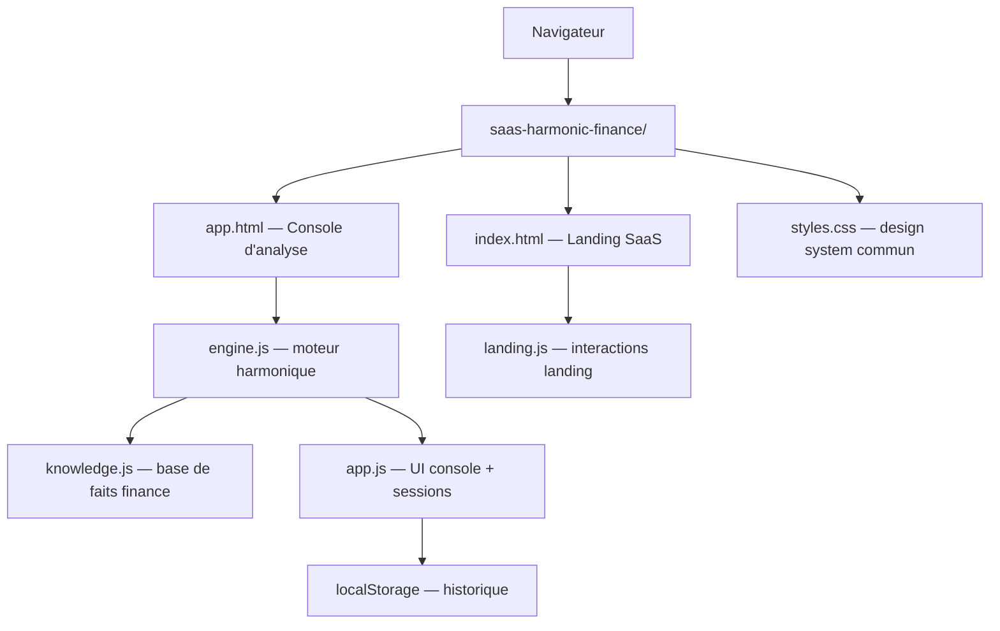
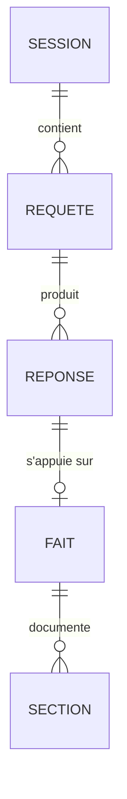

# Architecture Technique — Harmonic AI Finance (SaaS)

## 1. Conception de l'architecture



- Aucun backend. Le « moteur harmonique » tourne 100 % côté client (JS), déterministe.
- Base de connaissances embarquée (JSON en JS), sessions persistées en localStorage.

## 2. Description technique

- **Frontend** : HTML5 + CSS3 + JavaScript vanilla (ES2020), zéro build, cohérent avec l'écosystème statique du dépôt et déployable tel quel.
- **Moteur harmonique (engine.js)** — fidèle à la théorie :
  - `encode(texte)` : hash FNV-1a multi-graphes + φ-spacing → vecteur complexe unitaire ℂ¹²⁸ (normalisé).
  - `resonance(ψ_Q, ψ_F)` : Re(⟨ψ_Q|ψ_F⟩) ∈ [−1,1] — similarité cosinus complexe.
  - `gate` : seuil de cohérence (défaut 0.24) — sous le seuil → refus « absence de résonance ».
  - `confiance` : mapping résonance → % ± marge ; `responseId` : `resp_<hash10>_<horodatage>`.
- **Base de faits (knowledge.js)** : chaque fait = { id, domaine, mots-clés, titre, sections[{label, valeur}], confiance, marge, avertissement, formule? }.
- **Backend** : aucun. **Base de données** : localStorage (clé `haf_sessions`).

## 3. Définitions de routes

| Route | But |
|-------|-----|
| /index.html | Landing SaaS (fonctionnalités, pricing, CTA) |
| /app.html | Console d'analyse harmonique (prompt → réponse/refus) |

## 4. Définitions API

API interne (moteur, côté client) :

```js
HarmonicEngine.solve(prompt) => {
  id: "resp_xxxx_20260805...",          // Response ID
  status: "answered" | "refused",
  query: "…",
  score: 0.87,                           // résonance max
  fact: { id, title, sections, source, confidence, margin, caveat },
  confidence_label: "97 % ±2 %",
  disclaimer: "…"                        // présent si status refused ou caveat
}
```

## 5. Diagramme d'architecture serveur

Sans objet (aucun serveur).

## 6. Modèle de données

### 6.1 Définition du modèle



### 6.2 Sources de vérité (contenu)

| Fait | Contenu source |
|---|---|
| MiFID II — Article 26 | UE 600/2014, reporting T+1, 65 champs, ESMA |
| MiFID II — Article 20 | Directive 2014/65/EU, transparence pré-trade |
| RTS 22 | Règlement délégué 2017/583, formats de reporting |
| VaR 95 % (RiskMetrics) | Formule VaR = V × z × σ × √t, calcul $2 961 000 |
| Expected Shortfall | Alternative à la VaR, Bâle III.5 2025 |

## 7. Contraintes techniques

- Zéro dépendance externe, polices Google Fonts (Fraunces + IBM Plex Mono, non bloquantes).
- Accessibilité : contrastes AA, focus visible, `prefers-reduced-motion`.
- Déterminisme : mêmes entrées → mêmes sorties (hash déterministe, pas de Math.random dans le scoring).
- Performance : moteur O(n·d) sur ~6 faits × 128 dims — instantané.
