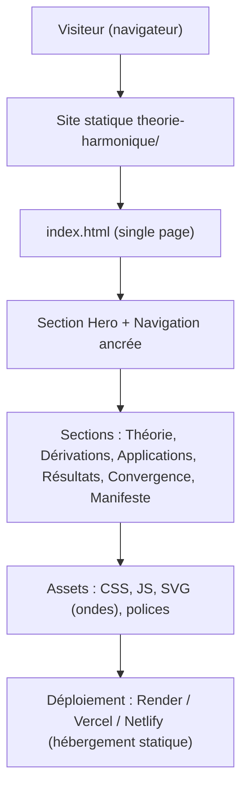
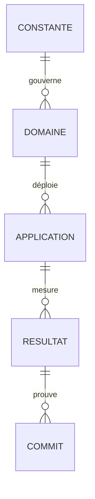

# Architecture Technique — Site Théorie Harmonique Universelle

## 1. Conception de l'architecture



- Aucun backend. Aucune base de données. Données embarquées en JS (constantes, benchmarks, applications).
- Rendu 100 % côté navigateur ; animations CSS + Canvas/SVG pour les ondes.

## 2. Description technique

- **Frontend** : HTML5 + CSS3 (variables, clamp, grid) + JavaScript vanilla (interactions, compteurs animés). Choix volontaire : zéro dépendance build, cohérent avec l'écosystème statique existant du dépôt (ka_redesign, docs/, www/), déploiement instantané.
- **Init** : fichiers créés à la main (index.html, styles.css, app.js, assets/) — pas de scaffolding nécessaire.
- **Backend** : aucun.
- **Base de données** : aucune — données statiques (constantes, équivalences, benchmarks) dans `data.js`.

## 3. Définitions de routes

| Route | But |
|-------|-----|
| / | Page unique : Hero → Théorie → Dérivations → Applications → Résultats → Convergence → Manifeste |

Navigation par ancres `#theorie`, `#derivations`, `#applications`, `#resultats`, `#preuves`, `#manifeste`.

## 4. Définitions API

Aucune API (site statique). Les données sont exposées via un objet global `THU_DATA` dans `data.js` :

```js
// Structure de référence (non-exhaustive)
THU_DATA = {
  constants: [
    { n: 1, symbol: "φ", value: 1.618033988749895, meaning: "anti-résonance, proportion" },
    ...
  ],
  domains: [
    { id: "llm", name: "Intelligence / LLM", equivalences: 36, modules: [...], keyResult: "..." },
    ...
  ],
  benchmarks: [
    { name: "GSM8K", result: "99,2% (1308/1319)", commit: "77bfca5", verified: true },
    ...
  ]
}
```

## 5. Diagramme d'architecture serveur

Sans objet (aucun serveur).

## 6. Modèle de données

### 6.1 Définition du modèle



### 6.2 Sources de vérité (artefacts du dépôt)

| Jeu de données | Source dans le dépôt |
|---|---|
| 7 constantes Hₙ | `HARMONIC_THEORY.md`, `SEPT_CONSTANTES_INFINI.md` |
| 36 équivalences LLM | `TRADUCTION_ONDULATOIRE_LLM.md` |
| 25 équivalences TTS | `TRADUCTION_ONDULATOIRE_TTS.md` |
| Benchmarks | `benchmark_lm_arena_maths_code.json` (v4.0, 100 %), `benchmark_hwat_scaled.json`, commit `77bfca5` (GSM8K 99,2 %) |
| Preuves | `CONVERGENCE_DES_PREUVES.md` |
| HPU | `ordinateur_harmonique/BENCHMARK_COMPARATIF.md` |

## 7. Contraintes techniques

- Zéro dépendance externe (pas de CDN bloquant ; polices auto-hébergées ou fallback système).
- Accessibilité : contrastes AA sur fond sombre, focus visible, `prefers-reduced-motion` respecté.
- Performance : pas de framework, chargement instantané, animations GPU-friendly.
- Compatibilité : navigateurs modernes (2024+), responsive desktop-first.
