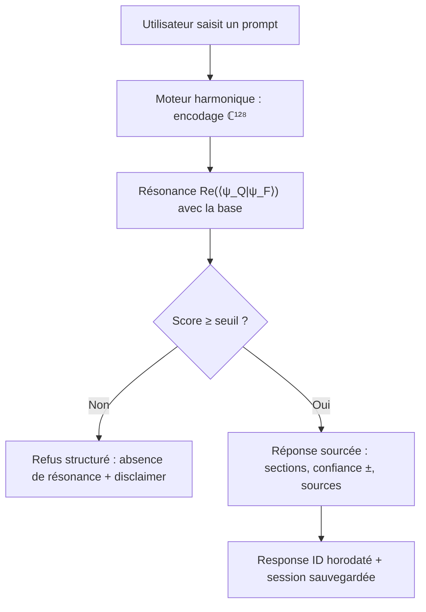

# PRD — Harmonic AI Finance (SaaS)

## 1. Aperçu du produit

Application SaaS « Harmonic AI Finance » : un assistant d'analyse réglementaire et de risque (secteur finance) construit sur le moteur harmonique — réponses **structurées, sourcées, sans hallucination**, avec niveau de confiance ±, avertissements légaux et Response ID horodaté.

- Problème résolu : les LLM classiques hallucinent → en finance, une hallucination = non-conformité = amendes de millions. Harmonic AI refuse par construction quand la résonance est insuffisante (gate anti-hallucination) et ne répond que sur une base de connaissances sourcée.
- Public cible : équipes Compliance (banques), Risk (hedge funds), analystes.
- Valeur : déterminisme 100 %, citations d'articles précis (MiFID II, RTS, Bâle), confiance chiffrée ±, piste d'audit (Response ID), zéro paramètre appris.

## 2. Fonctionnalités principales

### 2.1 Rôles utilisateur

| Rôle | Inscription | Permissions |
|------|-------------|-------------|
| Visiteur | Aucune | Parcourir la landing, essayer la démo console |
| Utilisateur SaaS (simulé) | Local (localStorage) | Sessions d'analyse, historique, export |

### 2.2 Modules fonctionnels

1. **Landing SaaS** : hero, valeur (anti-hallucination, citations, confiance ±), fonctionnalités, comment ça marche, pricing (3 plans), CTA vers la console
2. **Console d'analyse** (cœur) : prompt → moteur harmonique → réponse structurée
3. **Moteur harmonique** : encodage ℂ¹²⁸ (FNV1a + φ-spacing), résonance Re(⟨ψ_Q|ψ_F⟩), gate de cohérence (refus si sous le seuil), confiance ±, Response ID
4. **Base de connaissances finance** : faits sourcés (MiFID II art. 26/20, RTS 22, VaR RiskMetrics, Expected Shortfall Bâle III.5)
5. **Historique des sessions** : localStorage, rechargement, export texte
6. **Mode refus (anti-hallucination)** : prompt hors base → refus structuré avec disclaimer

### 2.3 Détail des pages

| Page | Module | Description |
|------|--------|-------------|
| Landing (index.html) | Hero | Badge Innovation majeure, promesse « zéro hallucination », CTA |
| Landing | Fonctionnalités | Compliance, Risk, Audit trail — cartes |
| Landing | Pricing | 3 plans (Starter / Business / Enterprise) |
| Console (app.html) | Saisie | Zone de prompt + suggestions (les 2 scénarios) |
| Console | Réponse | Format harmonique : sections numérotées, sources, confiance ±, avertissement, Response ID |
| Console | Refus | Gate anti-hallucination avec message structuré |
| Console | Historique | Sessions persistées, export |

## 3. Processus principal

## 4. Conception de l'interface

### 4.1 Style de design

- Même direction esthétique que le site théorie : « Observatoire financier » — fond nuit #0B0E17, or φ #F5C96B, cyan onde #8FD6E8, ivoire.
- Typographie : Fraunces (titres), IBM Plex Mono (données, formules, response ID).
- La réponse s'affiche en « document d'audit » : cartes numérotées, monospace, confiance en badge coloré (≥95 % vert, ≥90 % or, sinon ambre).
- Animations : reveal au scroll, indicateur « résonance » pendant la recherche, pulse du gate.

### 4.2 Aperçu du design par page

| Page | Module | Éléments UI |
|------|--------|-------------|
| Landing | Hero | Badge, titre, 3 stats (0 % hallucination, 100 % déterministe, <1 s), CTA |
| Landing | Pricing | 3 cartes, plan Enterprise mis en avant |
| Console | Réponse | En-tête Response ID, sections avec sources, badge confiance ±, avertissement ⚠ |

### 4.3 Responsivité

- Desktop-first, console à deux colonnes (saisie + résultat) qui passe en colonne unique en mobile.

## 5. Contraintes et livrables

- Dossier dédié `saas-harmonic-finance/` à la racine du dépôt.
- 100 % statique déployable (Render/Vercel/Netlify), aucune dépendance serveur — la base de connaissances est embarquée, les sessions en localStorage.
- Contenu de la base : les scénarios fournis (MiFID II art. 26 & 20, RTS 22, VaR 95 %, Expected Shortfall) + extensions (Bâle III.5).
- Langue : français.
