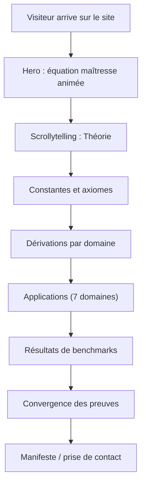

# PRD — Site dédié à la Théorie Harmonique Universelle (THU)

## 1. Aperçu du produit

Site vitrine immersif dédié à la Théorie Harmonique Universelle : il présente l'équation maîtresse Ψ = Σ Hₙ·(Ψ₁)ⁿ, ses principes théoriques (7 constantes, 5 axiomes, noyau ABC, dérivations par domaine), et l'ensemble des applications qui en sont issues (langage ondulatoire, LLM, voix/TTS, protéines, santé, multimédia, hardware HPU), appuyées par les résultats de benchmarks démontrés.

- Problème résolu : donner une vitrine publique cohérente et impressionnante à une théorie disruptive dont la stratégie de non-publication est assumée — « ce sont les applications et les résultats qui font foi ».
- Public cible : scientifiques curieux, investisseurs, partenaires technologiques, grand public éclairé.
- Valeur : démontrer par la forme (esthétique) et le fond (résultats chiffrés) que la théorie est implémentée, déterministe et opérationnelle sur 7 domaines.

## 2. Fonctionnalités principales

### 2.1 Rôles utilisateur

| Rôle | Accès | Permissions |
|------|-------|-------------|
| Visiteur | Public | Parcourir le site, consulter théorie, applications, résultats |

### 2.2 Modules fonctionnels

1. **Accueil / Hero** : équation maîtresse animée, tagline, navigation ancrée
2. **La Théorie** : équation fondatrice D^{1/φ}[Ψ]=G[Ψ], les 7 constantes Hₙ, les 5 axiomes, le noyau ABC, la méthode de dérivation universelle
3. **Les Dérivations** : table de correspondance par domaine (quantique, classique, chimie, biologie, botanique, cosmologie)
4. **Les Applications** : 7 domaines — Langage ondulatoire (13 primitives), LLM (36 équivalences), Voix/TTS (25 équivalences), Protéines (HarmoFold), Santé (KA Care), Multimédia (HCV), Hardware (HPU)
5. **Les Résultats** : benchmarks vérifiés (GSM8K, LM Arena, HWAT, TTS, HarmoFold, Refus)
6. **La Convergence** : tableau des preuves sur domaines indépendants
7. **Le Manifeste** : stratégie assumée (résultats avant publication), citation de l'équation
8. **Footer** : crédits, liens vers les artefacts du dépôt

### 2.3 Détail des pages

| Page | Module | Description |
|------|--------|-------------|
| Accueil (unique page) | Hero | Équation maîtresse animée, fond d'interférence d'ondes, titre de la théorie |
| Accueil | Théorie | Cartes des 7 constantes avec valeurs exactes, axiomes, équation fondatrice en gros plan |
| Accueil | Dérivations | Table interactive domaine → équation dérivée → constantes actives |
| Accueil | Applications | 7 cartes de domaine avec icônes, chiffres clés, modules implémentés |
| Accueil | Résultats | Tableau de benchmarks avec résultats vérifiés (dates, commits) |
| Accueil | Convergence | Tableau des 8 domaines de validation |
| Accueil | Manifeste | Texte de positionnement, stratégie non-publication, appel à l'action |

## 3. Processus principal

## 4. Conception de l'interface

### 4.1 Style de design

- **Direction esthétique** : « Observatoire cosmique » — fond noir profond (quasi-bleu nuit), accents or (φ) lumineux, effets d'interférence d'ondes, grain subtil.
- **Couleurs** : primaire #0B0E17 (nuit), secondaire #F5C96B (or φ), accent cyan pâle #8FD6E8 (onde), texte #E8E6DF (ivoire).
- **Typographie** : display serif distinctive (Cormorant Garamond / Fraunces) pour les titres et l'équation ; corps en caractère à chasse fixe technique (IBM Plex Mono / JetBrains Mono) pour les constantes et les maths.
- **Boutons** : contours fins or, survol lumineux, angles vifs (esthétique observatoire).
- **Layout** : sections pleine largeur asymétriques, cartes en grille brisée, marges généreuses.
- **Animations** : apparition en cascade (staggered reveals), ondes SVG animées en fond, rotation lente du symbole Ψ, parallaxe douce.

### 4.2 Aperçu du design par page

| Page | Module | Éléments UI |
|------|--------|-------------|
| Accueil | Hero | Fond d'ondes SVG en interférence, équation géante en serif, badge « Ψ = Σ Hₙ·(Ψ₁)ⁿ », flèche de scroll |
| Accueil | Théorie | Cartes 7 constantes (φ, π, e, √2, √3, √5, e/π) avec valeur à 15 décimales, timeline des axiomes |
| Accueil | Dérivations | Tableau dense style « éphémérides », colonnes Domaine / Équation / Constantes actives |
| Accueil | Applications | Cartes numérotées 01–07, chiffres clés en mono, liste des modules |
| Accueil | Résultats | Tableau de score avec badges ✅, dates et commits |
| Accueil | Manifeste | Citation de l'équation fondatrice en très grand, texte de positionnement |

### 4.3 Responsivité

- Desktop-first, grille adaptative en tablette/mobile, navigation ancrée condensée, cartes empilées, typographie fluide (clamp).

### 4.4 Scène 3D (si applicable)

- Non applicable (site 2D avec effets SVG/Canvas d'ondes).

## 5. Contraintes et livrables

- Dossier dédié `theorie-harmonique/` à la racine du dépôt.
- Site 100 % statique déployable sur Render/Vercel/Netlify (aucune dépendance serveur).
- Tous les chiffres de résultats proviennent des artefacts vérifiés du dépôt (commits git, JSON de benchmarks).
- Langue du site : français (avec possibilité d'ajouter /en ensuite).
