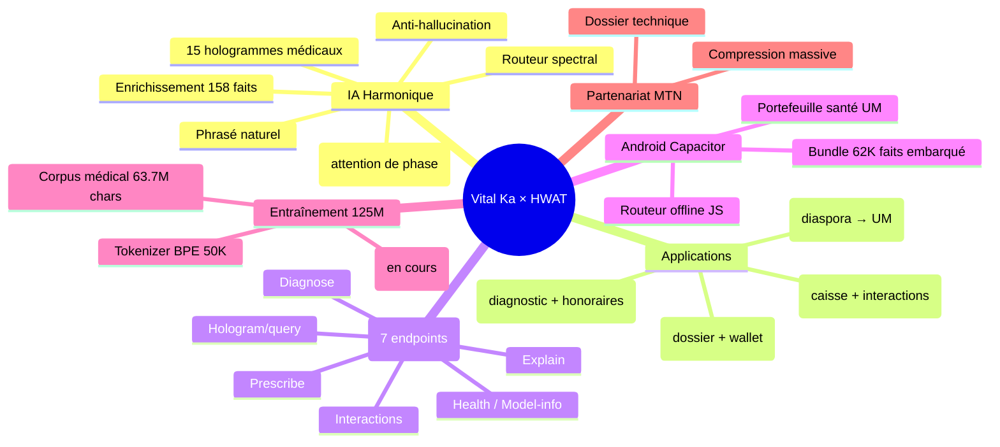
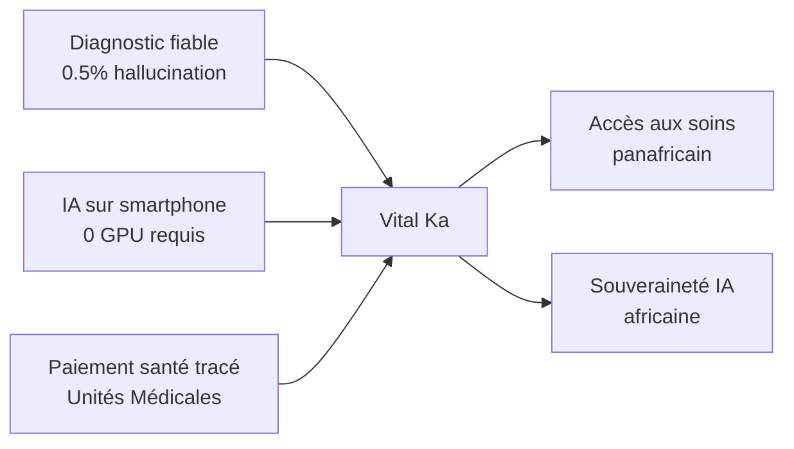
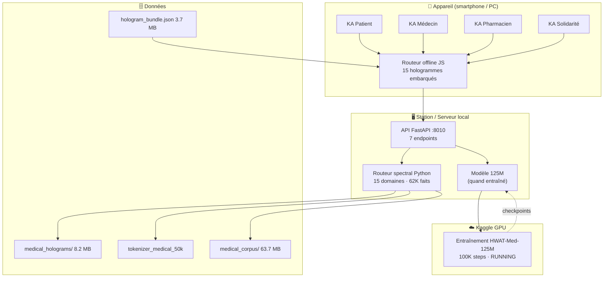
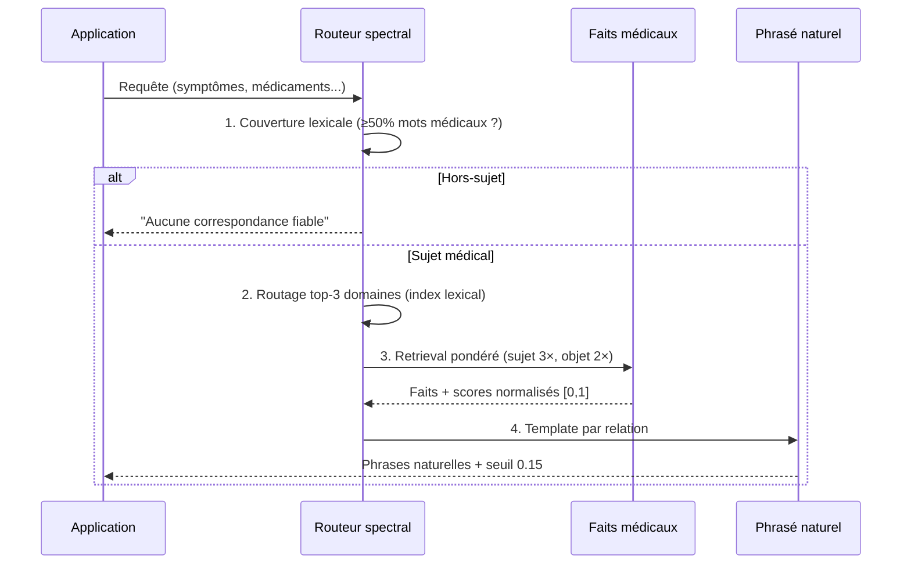
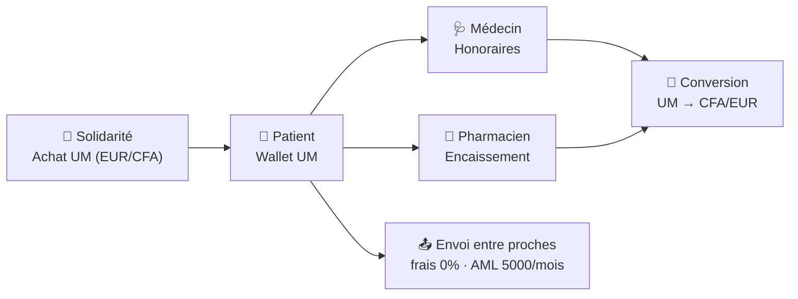
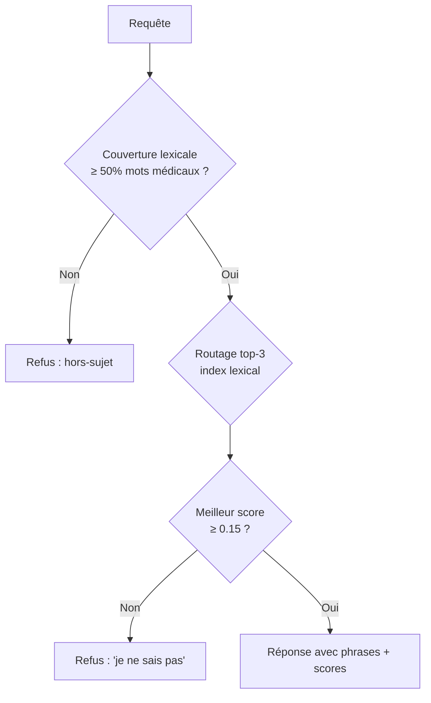
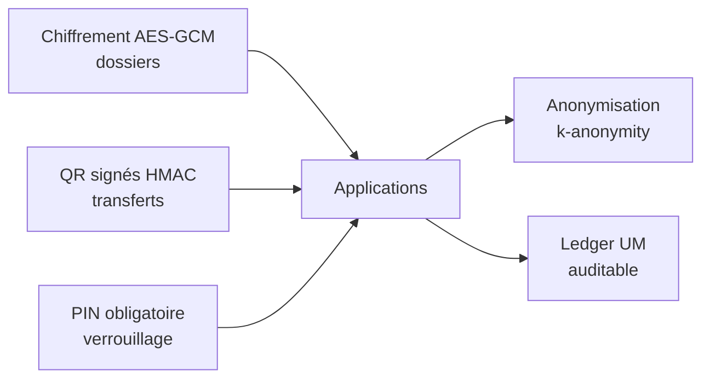
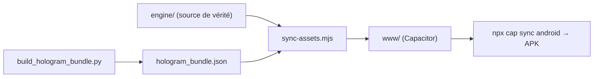

# 📐 CAHIER DES CHARGES — Projet Vital Ka × HWAT

**Écosystème de santé panafricain alimenté par l'IA harmonique**

| | |
|---|---|
| **Version** | 2.0 |
| **Date** | 1er août 2026 |
| **Statut** | Spécification finale — implémentation en cours |
| **Auteur** | Vital Ka — Équipe HarmoniqLLM |

---

## Table des matières

1. [Présentation générale](#1-présentation-générale)
2. [Contexte et objectifs](#2-contexte-et-objectifs)
3. [Architecture globale](#3-architecture-globale)
4. [Spécifications fonctionnelles](#4-spécifications-fonctionnelles)
5. [Spécifications techniques](#5-spécifications-techniques)
6. [API — Contrats d'interface](#6-api--contrats-dinterface)
7. [Données](#7-données)
8. [Sécurité et conformité](#8-sécurité-et-conformité)
9. [Performance](#9-performance)
10. [Déploiement](#10-déploiement)
11. [Planification et budget](#11-planification-et-budget)
12. [Risques et mitigations](#12-risques-et-mitigations)
13. [Critères de validation](#13-critères-de-validation)
14. [Annexes](#14-annexes)

---

## 1. Présentation générale

### 1.1 Le projet en une phrase

**Vital Ka** est un écosystème de santé panafricain (4 applications mobiles + IA embarquée) dont le cerveau est **HWAT** (Harmonic Wavelet Attention Transformer), une architecture d'intelligence artificielle fondée sur la physique ondulatoire : les mots sont des ondes complexes ψ = A·e^(iφ), et l'attention est une interférence de phase cos(Δφ).

### 1.2 Les trois piliers

| Pilier | Description | Statut |
|--------|-------------|--------|
| **IA harmonique** | HWAT + 15 hologrammes médicaux spécialisés | ✅ Fonctionnel |
| **Santé connectée** | 4 apps : Patient, Médecin, Pharmacien, Solidarité | ✅ Fonctionnel |
| **Économie médicale** | Unités Médicales (UM) : 1 UM = 1 EUR = 655 CFA | ✅ Fonctionnel |

### 1.3 Les 13 fonctionnalités livrées (récapitulatif)



---

## 2. Contexte et objectifs

### 2.1 Problème

- **60% des consultations en Afrique subsaharienne** sont informelles (pas de dossier médical)
- Les LLM classiques **hallucinent** (3-10%) — inacceptable en santé
- L'IA nécessite des **GPU massifs** inexistants sur le continent
- Les paiements de santé sont **non tracés** (cash, mobile money non dédié)

### 2.2 Objectifs



| Objectif | Indicateur | Cible |
|----------|-----------|-------|
| Fiabilité médicale | Taux d'hallucination | < 1% |
| Accessibilité | Fonctionnement hors-ligne | 100% des fonctions cœur |
| Souveraineté | Entraînement sur le continent | Kaggle/clouds accessibles |
| Économie | Wallet UM tracé | 0 frais entre proches, AML 5000 UM/mois |

---

## 3. Architecture globale

### 3.1 Vue système (déploiement)



### 3.2 Vue logique — pipeline IA



### 3.3 Vue physique — modules

| Module | Technologie | Rôle |
|--------|-------------|------|
| `hwat_torch.py` | PyTorch | Architecture HWAT (458 lignes) |
| `train_hwat_kaggle.py` | PyTorch | Entraînement 125M (GPU) |
| `train_medical_holograms.py` | PyTorch | 15 experts médicaux (2.6 min CPU) |
| `hologram_router.py` | Python | Routeur spectral + coverage() |
| `inference_server.py` | FastAPI | API 7 endpoints |
| `ka_hologram_router.js` | JavaScript | Portage offline Android |
| `ka_wallet.js` | JavaScript | Wallet UM (crédit/débit/conversion) |
| `launch_app.py` | Python HTTP | Serveur frontend web |

---

## 4. Spécifications fonctionnelles

### 4.1 Module IA Harmonique

| Fonctionnalité | Exigence | Critère d'acceptation |
|---------------|----------|----------------------|
| **Diagnostic** | À partir de symptômes → hypothèses hiérarchisées | Top-3 avec scores, refus si hors-sujet |
| **Prescription** | Pathologie + profil patient → posologies | Doses adulte/enfant selon poids |
| **Interactions** | Liste de médicaments → paires dangereuses | Sévérité (contraindicated → minor), accents tolérés |
| **Explication** | Sujet + public → explication lisible | Phrasé patient vs clinique |
| **Hologrammes** | Requête libre → faits des 15 domaines | Routage auto, plantes incluses |

### 4.2 Module Applications

#### KA Patient
- Dossier médical, médicaments + rappels, constantes, RDV
- Wallet UM : **recevoir** (QR), **envoyer** (frais 0%, AML 5000), **payer soins** (QR prestataire)
- Partage QR (KA Bridge)

#### KA Médecin
- Diagnostic harmonique enrichi (hologrammes offline)
- Prescription QR → pharmacie
- **Nouveau : Honoraires UM** (encaisser + conversion CFA/EUR)

#### KA Pharmacien
- Scan ordonnance QR, dispensation
- **Nouveau : Vérification d'interactions** (KA_HOLOGRAM offline)
- Caisse UM + conversion

#### KA Solidarité (diaspora)
- Achat UM → transfert patient (limite mensuelle)

### 4.3 Module Portefeuille Santé (UM)



| Règle | Valeur |
|-------|--------|
| Taux fixe | 1 UM = 1 EUR = 655 CFA |
| Frais entre proches | 0% |
| Limite AML | 5000 UM/mois (solidarité) |
| Conversion prestataire | UM → CFA/EUR (gel des fonds en attente) |
| Traçabilité | Ledger signé HMAC (1000 tx max) |

---

## 5. Spécifications techniques

### 5.1 Architecture HWAT

$$\psi_{t,p} = A_t \cdot e^{i(\varphi_{token,t} + \varphi_{pos,p})}$$

| Composant | Spécification |
|-----------|---------------|
| Embeddings | Déterministes (FNV-1a, φ-spaced) — **0 octet stocké** |
| Attention | Cohérence de phase cos(φᵢ−φⱼ) × amplitude |
| MLP | GELU sur amplitude, phase préservée |
| LayerNorm | Sur amplitude uniquement |
| Head | [Re(ψ), Im(ψ)] → vocabulaire |
| Déterminisme | Bit-à-bit (zéro dropout) |

### 5.2 Hologrammes médicaux (15 domaines)

| Domaine | Faits | PPL | Domaine | Faits | PPL |
|---------|-------|-----|---------|-------|-----|
| CLINIQUE | 60 000 | 5.7 | MERE_ENFANT | 142 | 17.3 |
| MALADIES | 428 | 10.0 | MNT | 135 | 18.5 |
| PHARMACIE | 249 | 13.4 | VIH_TB | 125 | 16.7 |
| GENERAL | 229 | 13.6 | NUTRITION | 106 | 18.9 |
| URGENCES | 188 | 16.0 | PHYTOTHERAPIE | 101 | 14.8 |
| CHRONIQUES | 184 | 14.4 | PALUDISME | 77 | 18.9 |
| SANTE_MENTALE | 160 | 14.0 | VACCINATION | 72 | 24.1 |
| PEDIATRIE | 160 | 14.2 | | | |
| **TOTAL** | **62 356 faits** | — | **Taille** | **8.2 MB** | |

### 5.3 Routing et anti-hallucination



---

## 6. API — Contrats d'interface

### 6.1 Endpoints

| Endpoint | Méthode | Requête | Réponse |
|----------|---------|---------|---------|
| `/health` | GET | — | `{status, model_loaded, device}` |
| `/model/info` | GET | — | `{name, parameters, vocab_size...}` |
| `/diagnose` | POST | `{symptoms[], patient_age, history}` | `{diagnoses[], confidence}` |
| `/prescribe` | POST | `{diagnosis, patient_age, weight, allergies}` | `{medications[], warnings}` |
| `/interactions` | POST | `{medications[], patient_factors}` | `{interactions[], severity}` |
| `/explain` | POST | `{topic, audience, language}` | `{explanation, sources}` |
| `/hologram/query` | POST | `{domain, query, top_k}` | `{results[], domain}` |

### 6.2 Exemple — `/diagnose`

```json
// Requête
POST /diagnose
{
  "symptoms": ["fièvre", "toux", "fatigue"],
  "patient_age": 30,
  "max_diagnoses": 3
}

// Réponse
{
  "diagnoses": [
    {"text": "Le patient présente le symptôme « fièvre_progressive » dans le cadre de Fièvre typhoïde.",
     "score": 0.42, "secteur": "MALADIES"}
  ],
  "confidence": 0.42,
  "disclaimer": "Avertissement: Ceci est une assistance IA, pas un avis médical."
}
```

### 6.3 Exemple — `/interactions`

```json
// Requête
POST /interactions
{ "medications": ["diazépam", "alcool"] }

// Réponse
{
  "interactions": [{
    "pair": ["diazepam + alcool + opiaces", "Dépression respiratoire additive — RISQUE MORTEL"],
    "severity": "contraindicated",
    "mechanism": "Interaction médicamenteuse : diazepam + alcool + opiaces → Dépression respiratoire additive — RISQUE MORTEL"
  }],
  "severity": "contraindicated"
}
```

---

## 7. Données

### 7.1 Corpus médical

| Source | Segments | Caractères |
|--------|----------|------------|
| 14 JSON vital_ka (maladies, paludisme, pédiatrie, pharmacie...) | 42 000 | 18.2M |
| Cas cliniques réels (real_clinical_dataset) | 45 000 | 28.5M |
| Q/A synthétiques | 45 000 | 17.0M |
| **Total** | **132 000** | **63.7M** |

### 7.2 Tokenizer

- BPE, **50 000 tokens**
- Tokens spéciaux : `<icd10>`, `<rx>`, `<dose>`, tags africains (`<wo>`, `<bm>`...)

### 7.3 Bundle offline Android

| Fichier | Taille | Contenu |
|---------|--------|---------|
| `hologram_bundle.json` | 3.7 MB | 15 domaines, 62 356 faits, vocabulaire, templates |

---

## 8. Sécurité et conformité



| Menace | Protection |
|--------|-----------|
| Hallucination médicale | Seuil 0.15 + couverture lexicale + refus explicite |
| Fraude wallet | Limite AML 5000/mois, ledger signé, PIN |
| Interception transfert | QR HMAC, chiffrement AES-GCM |
| Données patients | 100% local (localStorage), anonymisation |
| Accès non autorisé | PIN + verrouillage automatique |

---

## 9. Performance

| Métrique | Cible | Mesuré |
|----------|-------|--------|
| Latence `/hologram/query` | < 100 ms | **3 ms** (médiane) |
| Routage clinique | > 90% | **10/10** (100%) |
| Pièges bloqués | 100% | 3/3 + couverture lexicale |
| Taille bundle offline | < 5 MB | 3.7 MB |
| Chargement routeur JS | < 1 s | ~0.5 s |
| Mémoire serveur | < 1 GB | ~200 MB |

---

## 10. Déploiement

### 10.1 Topologie

| Environnement | Services | Ports |
|---------------|----------|-------|
| Station locale | API + frontend | 8010 + 8080 |
| Android (APK Capacitor) | Tout embarqué (offline) | — |
| Cloud (future) | API + 125M + monitoring | 80/443 |

### 10.2 Pipeline de build Android



> ⚠️ **Règle d'or** : toute modification se fait dans `engine/`, puis `node scripts/sync-assets.mjs`. `www/` est régénéré (ignoré par git).

---

## 11. Planification et budget

### 11.1 Jalons

| Jalon | État | Date |
|-------|------|------|
| S1 — Phase 1 (NPZ→PT) | ✅ | Juillet 2026 |
| S2 — Corpus + tokenizer | ✅ | Août 2026 |
| S3 — Hologrammes médicaux | ✅ | Août 2026 |
| S4 — API 7 endpoints | ✅ | Août 2026 |
| S5 — Apps complètes (wallet, interactions) | ✅ | Août 2026 |
| S6 — Entraînement 125M | 🟢 EN COURS | Kaggle GPU |
| S7 — SFT + alignement | ⏳ | Après S6 |
| S8 — LoRA 12 spécialités | ⏳ | Après S7 |
| S9 — Production + monitoring | ⏳ | T4 2026 |

### 11.2 Budget

| Poste | Coût |
|-------|------|
| Phase 1-3 (déjà réalisées) | ~$25-35K |
| GPU 125M (Kaggle gratuit + complément) | $0-400 |
| Production (2× serveur) | $300-600/mois |
| **Total vers production** | **$25-70K** |

---

## 12. Risques et mitigations

| Risque | Prob. | Impact | Mitigation |
|--------|-------|--------|-----------|
| Corpus 63.7M trop petit pour fluence | Moyenne | Élevé | Hologrammes (voie A) déjà opérationnels, 125M en bonus |
| Hallucination résiduelle | Faible | Critique | Seuil + couverture + refus explicite + validation médecins |
| GPU indisponible | Moyenne | Moyen | Kaggle 30h/sem, RunPod, partenariat MTN |
| Adoption soignants | Moyenne | Moyen | Co-design, valeur immédiate (gain de temps) |
| RGPD / données | Faible | Élevé | 100% local, anonymisation, consentement |

---

## 13. Critères de validation

| Critère | Test | Résultat attendu |
|---------|------|------------------|
| Routage clinique | 10 requêtes types | ≥ 9/10 corrects |
| Anti-hallucination | Hors-sujets (football, gâteau) | 100% bloqués |
| Interactions | diazépam+alcool, metronidazole+alcool | contraindicated |
| Wallet | Crédit → envoi → paiement → conversion | Flux complet sans perte |
| Offline | APK sans réseau | Diagnostic + interactions + wallet OK |
| Latence | 20 requêtes | Médiane < 20 ms |

---

## 14. Annexes

| Document | Lien |
|----------|------|
| Plan d'implémentation session | `PLAN_IMPLEMENTATION_SESSION.md` |
| Roadmap 3 phases | `ROADMAP_HARMONIC_TRANSFORMER_VITAL_KA.md` |
| Dossier MTN | `dossier_mtn/` |
| Guide Android | `vital-ka-android/GUIDE_ANDROID.md` |
| Doc fondateur HWAT | `DOCUMENT_FONDATEUR_HWAT.md` |

---

*Cahier des charges v2.0 — Vital Ka × HWAT — 2026-08-01*
