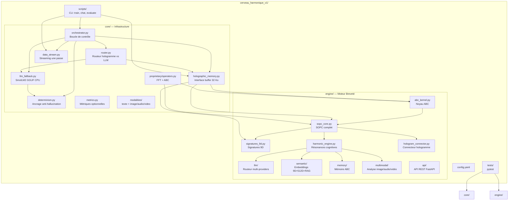
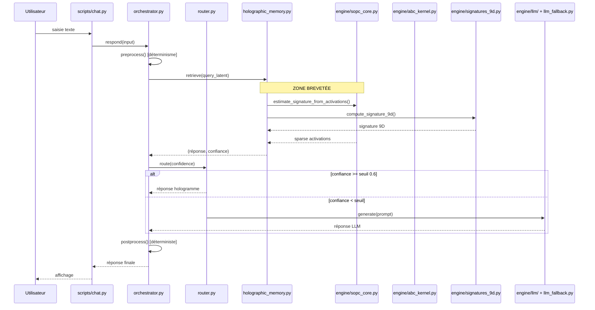
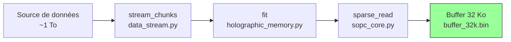
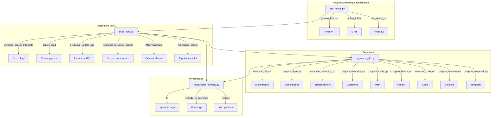

# Plan d'Architecture — Cerveau Harmonique SOPC

## Vue d'ensemble



---

## Pipeline de données — Flux complet



---

## Pipeline SOPC — Cœur mathématique

```mermaid
flowchart LR
    IN[Entrée texte] --> TOK[Tokenisation]
    TOK --> S9D[Signature 9D]
    S9D --> SL[Seuil Lloyd<br/>N_qubits = S + log₂1/ε]
    SL --> SR[Sparse Read<br/>WTA local + sigmoid φ²]
    SR --> PA[Prédicteur ABC pur<br/>0 paramètre, 0 divergence]
    PA --> FD[Dérivée fractionnaire ABC<br/>D^α_t = ABCα·K0·εt + ΣKτ·εt-τ]
    FD --> PG[Phase Gate ABC<br/>ω₀ = φ, θ = ω₀/φ, γ = ω₀·φ]
    PG --> ES[Estimation signature 9D]
    ES --> OUT[Sortie texte]
    
    style SL fill:#f96,stroke:#333
    style PA fill:#9cf,stroke:#333
    style FD fill:#9cf,stroke:#333
    style PG fill:#9cf,stroke:#333
```



---

## Pipeline d'entraînement (une passe)



---

## Dépendances entre modules



---

## Roadmap — Prochaines étapes

### Phase 1 : Validation immédiate
```mermaid
gantt
    title Phase 1 — Validation
    dateFormat  YYYY-MM-DD
    section Tests
    Lancer pytest                     :a1, 1d
    Vérifier imports engine/          :a2, 1d
    section Package
    Créer setup.py + pyproject.toml   :b1, 1d
    pip install -e .                  :b2, 1d
    section Chatbot
    Tester chat.py end-to-end         :c1, 2d
    Tracer buffer 32 Ko              :c2, 1d
```

### Phase 2 : Connexion réelle
```mermaid
gantt
    title Phase 2 — Connexion
    dateFormat  YYYY-MM-DD
    section Hologramme
    Connecter ka_knowledge_base/hologramme.npy  :d1, 3d
    Valider résonance réelle                     :d2, 2d
    section LLM
    Intégrer engine/llm/router.py comme fallback  :e1, 2d
    Tester OpenAI/Anthropic/Mistral              :e2, 2d
    section Multimodal
    Activer image via engine/multimodal/          :f1, 2d
    Activer audio                                :f2, 2d
    Activer vidéo                                :f3, 2d
```

### Phase 3 : Production
```mermaid
gantt
    title Phase 3 — Production
    dateFormat  YYYY-MM-DD
    section API
    Exposer engine/api/server.py          :g1, 2d
    Documentation Swagger                 :g2, 1d
    section Déploiement
    Dockerfile + docker-compose           :h1, 2d
    Tests d'intégration                   :h2, 2d
    section Monitoring
    Métriques de performance              :i1, 2d
    Logs structurés                       :i2, 1d
```

---

## Composants clés et leurs responsabilités

| Composant | Fichier | Responsabilité | Dépend vers |
|---|---|---|---|
| **Noyau ABC** | `engine/abc_kernel.py` | Mittag-Leffler, Gamma Lanczos, noyau Kτ | — |
| **SOPC** | `engine/sopc_core.py` | Seuil Lloyd, sparse read, prédicteur ABC, dérivée fractionnaire, gate φ, résonance | `abc_kernel` |
| **Signatures 9D** | `engine/signatures_9d.py` | Extraction des 9 dimensions cognitives | — |
| **Mémoire holographique** | `core/holographic_memory.py` | Buffer 32 Ko, fit/encode/retrieve | `sopc_core`, `signatures_9d`, `abc_kernel` |
| **Routeur** | `core/router.py` | Décision hologramme vs LLM selon confiance | `holographic_memory` |
| **Orchestrateur** | `core/orchestrator.py` | Boucle encode→route→post→decode | `router`, `holographic_memory`, `llm_fallback` |
| **Déterminisme** | `core/determinism.py` | Graines fixes, pré/post-processing, ancrage | — |
| **Streaming** | `core/data_stream.py` | Itérateur de chunks, une passe | — |
| **LLM Fallback** | `core/llm_fallback.py` | SmolLM2 GGUF CPU, décodage déterministe | `determinism` |
| **Opérateurs** | `core/proprietary/operators.py` | Pont FFT+ABC vers engine/ | `abc_kernel`, `sopc_core` |
| **LLM Router** | `engine/llm/router.py` | Multi-providers LLM | — |
| **Embeddings** | `engine/semantic/embeddings.py` | Hybrides 9D + 512D | `signatures_9d` |
| **Mémoire ABC** | `engine/memory/long_term.py` | Oubli basé sur le noyau ABC | `abc_kernel` |
| **Multimodal** | `engine/multimodal/analyzers.py` | Image/audio/vidéo → signature 9D | `signatures_9d` |
| **API** | `engine/api/server.py` | REST FastAPI | Tout le moteur |
