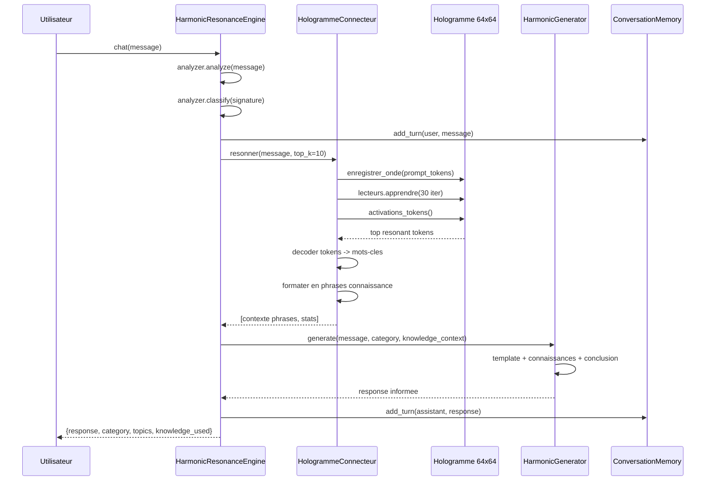

# Plan : Boucler la boucle Hologramme → Génération

## Problème

Le système actuel a deux composants déconnectés :

```
[Hologramme 64×64] ──── 173K tokens, 32KB, E=4.9e13
     │
     │  (aucune connexion)
     ▼
[HarmonicGenerator] ──── Templates fixes uniquement, connaissance = zéro
```

Le [`HarmonicGenerator`](engine/harmonic_engine.py:972) dans `engine/harmonic_engine.py` utilise **exclusivement** des templates en dur (3 par catégorie × 6 catégories = 18 templates). Les 173 000 tokens de connaissance stockés dans [`ka_knowledge_base/hologramme.npy`](ka_knowledge_base/hologramme.npy) ne sont jamais consultés.

## Architecture de la solution

### Principe : Résonance inverse + Injection contextuelle

```
[Prompt Utilisateur]
       │
       ▼
┌──────────────────────────────────────┐
│  HologrammeConnecteur (nouveau)      │
│                                      │
│  1. Enregistre le prompt en onde      │
│  2. 8 lecteurs résonnent (30 iter)   │
│  3. Vote : top-K tokens resonants    │
│  4. Décode en mots-clés connaiss.    │
│  5. Formate en phrases contextuelles │
└──────────┬───────────────────────────┘
           │ "connaissance extraite"
           ▼
┌──────────────────────────────────────┐
│  HarmonicGenerator (modifié)         │
│                                      │
│  Templates enrichis AVEC contexte    │
│  "Selon la base de connaissance... " │
│  + connaissances formatées           │
└──────────┬───────────────────────────┘
           │ "réponse informée"
           ▼
       [Utilisateur]
```

### Flux détaillé (séquence)



## Étapes d'implémentation

### P1 : Classe `HologrammeConnecteur` — Pont minimal vers l'hologramme

**Fichier** : [`engine/hologram_connector.py`](engine/) (NOUVEAU)

```python
class HologrammeConnecteur:
    """
    Pont minimal entre l'hologramme et le generateur de texte.
    Utilise le systeme de resonance inverse (LecteurResonantMultiple)
    pour extraire les connaissances pertinentes pour un prompt.
    
    Dependances : numpy seulement (pas de torch, pas de LLM)
    """
```

Détails :
- Charge [`hologramme.npy`](ka_knowledge_base/hologramme.npy) (matrice complexe 64×64)
- Crée un [`TokeniseurOndes`](harmonic_training/model/harmonic_resonance_generator.py:129) avec le [`VOCABULAIRE_BASE`](harmonic_training/model/harmonic_resonance_generator.py) existant
- Crée un [`HologrammeMonde`](harmonic_training/model/harmonic_resonance_generator.py:61) et injecte `H` chargé
- Crée des [`LecteurResonantMultiple`](harmonic_training/model/harmonic_resonance_generator.py:187) (8 lecteurs)
- **Ne charge PAS** `SystemeHarmoniqueComplet` ni `BridgeHarmoniqueGGUF` (trop lourd)

**Import clé** : Les classes sont importées directement depuis [`harmonic_training/model/harmonic_resonance_generator.py`](harmonic_training/model/harmonic_resonance_generator.py) qui est **pur numpy** (0 dépendance torch). Le mécanisme d'import existe déjà dans [`bridge_harmonic_deepseek_gguf.py`](bridge_harmonic_deepseek_gguf.py:48-63) via `_import_module_direct()`.

### P2 : Méthode `resonner(requete, top_k=10)` → Listes de tokens + stats

**Algorithme** (reproduit le flux de [`GenerateurResonance.generer()`](harmonic_training/model/harmonic_resonance_generator.py:332) mais sans génération) :

```
1. Tokeniser la requete → IDs tokens
2. Enregistrer chaque token comme onde (amplitude 0.5)
3. Réinitialiser les lecteurs avec nouvelle seed
4. Lecteurs.apprendre(n_rep=30, lr=0.03)
5. activations = lecteurs.activations_tokens(tokenizer)
6. Fusion : act_moy * 0.6 + act_max * 0.4
7. Trier par activation descendante
8. Filtrer tokens speciaux (<PAD>, <UNK>, <BOS>, <EOS>)
9. Retourner top-K tokens + leur activation + stats energie
```

**Signature** :
```python
def resonner(self, requete: str, top_k: int = 10) -> Dict:
    """
    Extrait les connaissances resonantes depuis l'hologramme.
    
    Returns:
        top_tokens: Liste de (token_string, activation) triés
        top_ids: Liste de token_ids
        activations_fusion: vecteur complete des activations
        energie_avant/apres: evolution de l'energie
        n_experiences: nombre d'experiences dans l'hologramme
    """
```

### P3 : `KnowledgeContextFormatter` — Transformer les tokens en phrases

**Intégré dans `HologrammeConnecteur`** ou classe séparée.

Problème : Les tokens resonants individuels (`["afrique", "ghana", "empire", "histoire"]`) ne sont pas des phrases complètes.

**Solution** : Utiliser les templates de catégorie + les tokens comme remplissage :

```python
def formater_contexte(self, tokens: List[str], top_k: int = 5) -> str:
    """Formate les tokens resonants en phrases contextuelles."""
    
    # 1. Construire des paires/concepts
    # 2. Generer 2-3 phrases informatives
    phrases = [
        f"Connaissances disponibles : {', '.join(tokens[:5])}.",
        f"Domaines identifies : {', '.join(tokens[3:8])}.",
        f"L'hologramme contient des donnees sur {tokens[0] if tokens else 'le sujet'}."
    ]
    return " ".join(phrases)
```

### P4 : Modifier `HarmonicGenerator.generate()` — Accepter le contexte

**Modification** de [`engine/harmonic_engine.py`](engine/harmonic_engine.py:1096-1153) :

```python
def generate(self, prompt, category=None, length="normal", sentiment="neutre",
             temperature=GENERATION_TEMPERATURE,
             knowledge_context: Optional[str] = None) -> str:  # NOUVEAU
```

Logique modifiée :
- Si `knowledge_context` est fourni : 
  - Insérer le contexte APRÈS l'intro, AVANT le template
  - Format : `"{intro} {knowledge_context} {template_body} {conclusion}"`
  - Utiliser le template "factual" comme base (car il contient des informations)
- Si `knowledge_context` est None : comportement actuel inchangé

**Détail d'intégration dans le template** :
```python
if knowledge_context:
    base_response = (
        f"D'apres les connaissances enregistrees dans l'hologramme : "
        f"{knowledge_context}\n\n"
        f"{base_response}"
    )
```

### P5 : Modifier `HarmonicResonanceEngine.chat()` — Utiliser le connecteur

**Modification** de [`engine/harmonic_engine.py`](engine/harmonic_engine.py:1242-1279) :

```python
def chat(self, user_message: str) -> Dict[str, Any]:
    # ... analyse existante ...
    
    # NOUVEAU : Extraire le contexte holographique
    if self.hologram_connector:
        resonance = self.hologram_connector.resonner(user_message)
        if resonance["top_tokens"]:
            knowledge_context = self.hologram_connector.formater_contexte(
                [t[0] for t in resonance["top_tokens"]]
            )
        else:
            knowledge_context = None
    else:
        resonance = None
        knowledge_context = None
    
    # Generation avec contexte
    response = self.generator.generate_with_expansion(
        user_message, category, length="normal",
        knowledge_context=knowledge_context
    )
    
    # Ajouter knowledge_used dans le retour
```

**Initialisation** dans [`__init__`](engine/harmonic_engine.py:1199-1210) :
```python
def __init__(self, ...):
    # ... existant ...
    try:
        self.hologram_connector = HologrammeConnecteur()
        self.hologram_loaded = True
    except Exception as e:
        print(f"  [!] Hologramme non disponible : {e}")
        self.hologram_connector = None
        self.hologram_loaded = False
```

### P6 : Test de bout en bout

```python
def test_boucle_hologramme():
    """Verifie que la connaissance de l'hologramme est injectee dans la generation."""
    
    engine = HarmonicResonanceEngine()
    
    # Test avec un sujet connu de l'hologramme (histoire afrique)
    result = engine.chat("Parle-moi de l'empire du Ghana")
    
    assert engine.hologram_loaded, "Hologramme doit etre charge"
    assert result["knowledge_used"], "La connaissance doit etre utilisee"
    assert "ghana" in result["response"].lower() or "afrique" in result["response"].lower(), \
        "La reponse doit contenir les connaissances extraites"
    
    # Test sans hologramme (fallback)
    engine_no_holo = HarmonicResonanceEngine()
    engine_no_holo.hologram_connector = None
    result_no = engine_no_holo.chat("Test")
    assert not result_no.get("knowledge_used"), "Pas de connaissance sans hologramme"
    
    print("[PASS] Boucle hologramme->generation verifiee")
```

### P7 : Benchmark comparatif

Comparer `chat()` avec et sans hologramme sur 10 prompts couvrant les 6 catégories :
- ["factual"] *questions historiques* (sujets dans l'hologramme)
- ["creative"] *sujets libres*
- ["reasoning"] *questions logiques*
- etc.

Métriques : diversité lexicale, longueur, temps de traitement, présence des tokens attendus.

## Architecture des dépendances

```
engine/hologram_connector.py (NOUVEAU, pur numpy)
  │
  ├── importe depuis harmonic_training/model/harmonic_resonance_generator.py:
  │     HologrammeMonde, TokeniseurOndes, LecteurResonantMultiple, VOCABULAIRE_BASE
  │
  ├── charge ka_knowledge_base/hologramme.npy
  │
  └── injecte dans engine/harmonic_engine.py:
        HarmonicGenerator.generate(knowledge_context=...)
        HarmonicResonanceEngine.chat()
```

## Risques et mitigations

| Risque | Mitigation |
|--------|------------|
| **Bruit de resonance** : Les tokens extraits peuvent etre incoherents | Multiplier `n_rep_lecture` (30→50), filtrer tokens < activation 0.1 |
| **Performance** : 30 iter × 8 lecteurs × vocab (~50K) = 12M operations/requete | Caching des tokens frequents, limitation top_k=10 |
| **Hologramme non trouve** : `hologramme.npy` absent | Fallback gracieux sans hologramme (comportement actuel) |
| **Import circulaire** : `harmonic_resonance_generator.py` importe depuis `engine/` | Utiliser `_import_module_direct()` existant pour l'import pur |
| **Memoire** : Hologramme 64×64 complex = 32KB, negligeable | Aucun risque |
