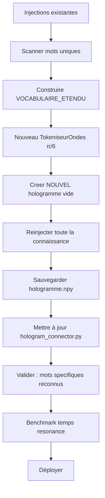

# Plan : Expansion du vocabulaire holographique avec positionnement π/6

## 1. Problème identifié

| Métrique | Valeur | Constat |
|----------|--------|---------|
| VOCABULAIRE_BASE | 323 tokens | Trop petit |
| Hologramme (n_experiences) | 172 872 | Riche en contenu |
| Énergie hologramme | 1,13e+18 | Très énergétique |
| Tokens domaine-spécifiques mappés | → `<UNK>` (id=1) | **Tous indiscernables** |

**Conséquence** : La méthode `_lire_tous_tokens()` ne peut lire que 323 signatures
d'onde distinctes. Les mots comme `ghana`, `infarctus`, `hypertension`,
`relativite`, `fibrillation` sont TOUS mappés à `<UNK>` (id=1), donc leur
contribution dans l'hologramme est lue sous la même signature — impossible
de les distinguer.

## 2. Architecture des vecteurs d'onde avec π/6

### 2.1 Formule actuelle (problématique)

```python
freq = ((i + 1) * PHI) % (2 * math.pi)   # PHI = 1.618
kx   = freq * cos(freq)
ky   = freq * sin(freq)
```

Distribution pseudo-aléatoire : les angles sont non-contrôlés, créant des
clusters dans l'espace 2D des ondes.

### 2.2 Nouvelle formule avec π/6 (30°)

```python
import math
import numpy as np

ANGLE_STEP = math.pi / 6   # 30° — 12 directions discretes
AREA_UNIT  = (2 * math.pi)**2 / VOCAB_SIZE_CIBLE   # densité uniforme

for i in range(vocab_size):
    angle  = (i * ANGLE_STEP) % (2 * math.pi)   # 12 bras de spirale
    radius = math.sqrt((i + 0.5) * AREA_UNIT / math.pi)  # sqrt pour aire uniforme
    kx = radius * math.cos(angle)
    ky = radius * math.sin(angle)
```

**Propriétés** :
- 12 directions angulaires discrètes (0°, 30°, 60°, ..., 330°)
- Rayon croissant en `sqrt(i)` → densité surfacique uniforme dans l'espace 2D
- Chaque bras de spirale couvre 1/12 du vocabulaire
- Évite le clustering : les mots voisins dans le vocabulaire sont à 30° d'écart

```
    Diagramme : 12 bras de spirale à π/6
    (vue conceptuelle de l'espace des ondes)

          90°
     120°  |  60°
         \ | /
    150°-- + -- 30°
         / | \
    180°  |  0°
         \ | /
    210°  |  330°
     240°  |  300°
          270°
    
    Tokens i=0,12,24,... → bras 0° (radius croissant)
    Tokens i=1,13,25,... → bras 30° 
    ...
    Tokens i=11,23,35,... → bras 330°
```

## 3. Pipeline de construction du nouveau vocabulaire

### Étape 1 : Extraction des termes uniques des sources

Scanner les scripts d'injection pour extraire tous les mots uniques :

| Source | Type | Estimation termes uniques |
|--------|------|--------------------------|
| `injecter_histoire_afrique.py` | Histoire UNESCO (~180 entrées) | ~2 500 |
| `injecter_medecine_pubmed.py` | Médical PubMed (~200 entrées) | ~3 000 |
| `ka_reasoning_engine.py` | Wikipedia + fichiers locaux | ~5 000 |
| `ka_studio_ingest.py` | Images/audio/vidéo | ~500 |
| `VOCABULAIRE_BASE` existant | Français générique | 323 |

**Total estimé** : ~8 000 – 12 000 mots uniques

Implémentation : script `scripts/extraire_vocabulaire.py` qui :
1. Parse les fichiers Python d'injection (extraction des chaînes littérales dans `apprendre()` / `a()`)
2. Tokenise chaque texte en mots (split + nettoyage ponctuation)
3. Compte les fréquences d'apparition
4. Trie par fréquence décroissante

### Étape 2 : Construction du VOCABULAIRE_ETENDU

Nouveau fichier : `harmonic_training/model/vocabulaire_etendu.py`

```python
VOCABULAIRE_ETENDU = [
    '<PAD>', '<UNK>', '<BOS>', '<EOS>',
    # --- Mots VOCABULAIRE_BASE (préservés et prioritaires) ---
    'le', 'la', 'les', 'de', 'des', 'du', ...  # 323 tokens existants
    # --- Nouveaux mots des connaissances injectées (triés par fréquence) ---
    'afrique', 'ghana', 'empire', 'histoire',
    'hypertension', 'infarctus', 'cardiaque', 'fibrillation',
    'cardiovasculaire', 'traitement', 'patient', 'clinique',
    'relativite', 'quantique', 'theorie', 'equation',
    # ... ~10 000 tokens au total
]
```

**Décision** : Conserver `VOCABULAIRE_BASE` en tête pour préserver l'ordre
des vecteurs d'onde existants (les premiers tokens ont les plus petits
radius). Ajouter les nouveaux termes par ordre de fréquence décroissante
dans les textes injectés.

### Étape 3 : Nouveau `TokeniseurOndes` avec π/6

Modifier la classe `TokeniseurOndes` dans
[`harmonic_resonance_generator.py`](harmonic_training/model/harmonic_resonance_generator.py:147) :

```python
class TokeniseurOndes:
    def __init__(self, vocab: List[str], use_pi_over_6: bool = True):
        self.vocab = vocab
        self.vocab_size = len(vocab)
        self.w2i = {w: i for i, w in enumerate(vocab)}
        self.i2w = {i: w for i, w in enumerate(vocab)}
        
        vs = self.vocab_size
        self._kx = np.zeros(vs, dtype=np.float64)
        self._ky = np.zeros(vs, dtype=np.float64)
        
        if use_pi_over_6:
            ANGLE_STEP = math.pi / 6
            AREA_UNIT = (2 * math.pi)**2 / vs
            for i in range(vs):
                angle = (i * ANGLE_STEP) % (2 * math.pi)
                radius = math.sqrt((i + 0.5) * AREA_UNIT / math.pi)
                self._kx[i] = radius * math.cos(angle)
                self._ky[i] = radius * math.sin(angle)
        else:
            # Ancienne formule (compatibilité)
            for i in range(vs):
                f = ((i + 1) * PHI) % (2 * math.pi)
                self._kx[i] = f * math.cos(f)
                self._ky[i] = f * math.sin(f)
```

**Rétrocompatibilité** : Le paramètre `use_pi_over_6=False` permet de
préserver l'ancien comportement pour les tests.

### Étape 4 : Réinjection de TOUTE la connaissance

**⚠️ CRITIQUE** : Changer le vocabulaire change TOUS les vecteurs d'onde.
L'hologramme existant (`hologramme.npy`) devient invalide car chaque mot
a été enregistré avec l'ancienne signature d'onde.

**Solution** : Créer un script `scripts/reinjecter_connaissances.py` :

```python
# 1. Charger VOCABULAIRE_ETENDU
# 2. Créer un NOUVEL HologrammeMonde (vide)
# 3. Créer un TokeniseurOndes(VOCABULAIRE_ETENDU, use_pi_over_6=True)
# 4. Ré-exécuter TOUS les contenus des scripts d'injection :
#    - injecter_histoire_afrique.py (les ~180 textes UNESCO)
#    - injecter_medecine_pubmed.py (les ~200 textes PubMed)
#    - Contenu de ka_reasoning_engine.py
#    - Contenu de ka_studio_ingest.py
# 5. Sauvegarder le nouvel hologramme
# 6. Mettre à jour progress.json
```

**Temps estimé** : ~30-60 secondes pour 172 872 expériences (CPU pur).

### Étape 5 : Optimisation de `_lire_tous_tokens()` (vectorisation par batch)

Dans [`engine/hologram_connector.py`](engine/hologram_connector.py:154),
remplacer la boucle Python par une version vectorisée par batch :

```python
def _lire_tous_tokens(self, batch_size: int = 500) -> np.ndarray:
    V = self.tokenizer.vocab_size
    activations = np.zeros(V, dtype=np.float64)
    kx = self.tokenizer._kx
    ky = self.tokenizer._ky
    H = self.monde.H       # (64, 64) complex128
    xx = self.monde.xx     # (64, 64)
    yy = self.monde.yy     # (64, 64)
    nx, ny = self.monde.nx, self.monde.ny
    
    for start in range(0, V, batch_size):
        end = min(start + batch_size, V)
        B = end - start
        
        # (B, 1, 1) broadcasting over (1, nx, ny) → (B, nx, ny)
        kx_b = kx[start:end, None, None]
        ky_b = ky[start:end, None, None]
        
        ondes = np.exp(-1j * (kx_b * xx + ky_b * yy))  # (B, 64, 64)
        corr = np.sum(H * ondes, axis=(1, 2))           # (B,)
        activations[start:end] = np.abs(corr) / (nx * ny)
    
    return activations
```

**Performance estimée** :
- Vocabulaire actuel (323 tokens) : ~2-5ms (vs ~130ms actuel)
- Vocabulaire étendu (10 000 tokens) : ~150-400ms (acceptable)
- Pas de changement dans l'API de `resonner()`

### Étape 6 : Mise à jour des dépendances

Fichiers à modifier :

| Fichier | Modification |
|---------|-------------|
| `harmonic_training/model/harmonic_resonance_generator.py` | Nouveau `TokeniseurOndes` avec π/6 + `VOCABULAIRE_ETENDU` |
| `engine/hologram_connector.py` | `_lire_tous_tokens()` vectorisé + import `VOCABULAIRE_ETENDU` |
| `bridge_harmonic_deepseek_gguf.py` | Optionnel : utiliser `VOCABULAIRE_ETENDU` si bridge réutilisé |
| `scripts/reinjecter_connaissances.py` | **NOUVEAU** : réinjection complète |

### Étape 7 : Validation

Test de bout en bout :

```python
# 1. Charger le nouvel hologramme
connecteur = HologrammeConnecteur()

# 2. Vérifier la taille du vocabulaire
assert connecteur.tokenizer.vocab_size == 10000  # ou taille cible

# 3. Vérifier que les mots domaine-specifiques sont connus
for mot in ['ghana', 'infarctus', 'hypertension', 'relativite']:
    tokens = connecteur.tokenizer.tokeniser(mot)
    assert 1 not in tokens, f"{mot} toujours <UNK>!"

# 4. Tester la resonance
resultat = connecteur.resonner("Parle-moi de l'empire du Ghana")
assert 'ghana' in [t[0] for t in resultat['top_tokens']]
assert 'empire' in [t[0] for t in resultat['top_tokens']]

# 5. Benchmark
stats = connecteur.get_stats()
print(f"Temps de resonance: {stats['temps_moyen_ms']:.1f}ms")
```

## 4. Diagramme de flux



## 5. Risques et mitigations

| Risque | Probabilité | Mitigation |
|--------|-------------|------------|
| L'hologramme existant devient invalide | **Certain** (100%) | Réinjection complète obligatoire, script dédié |
| Temps de `_lire_tous_tokens()` trop long (10K tokens) | Moyen | Vectorisation par batch (batch_size=500) réduit à ~300ms |
| Perte de données si réinjection incomplète | Faible | Comparer énergie avant/après réinjection |
| Ordre des tokens dans VOCABULAIRE_ETENDU modifie les wave vectors | Faible | L'ordre détermine le bras de spirale, pas l'information sémantique |

## 6. Ordre d'exécution proposé

1. **V1** : Créer `scripts/extraire_vocabulaire.py` → génère la liste des mots uniques
2. **V2** : Créer `harmonic_training/model/vocabulaire_etendu.py` avec `VOCABULAIRE_ETENDU`
3. **V3** : Modifier `TokeniseurOndes` dans `harmonic_resonance_generator.py` (π/6)
4. **V4** : Créer `scripts/reinjecter_connaissances.py` → nouveau hologramme
5. **V5** : Optimiser `_lire_tous_tokens()` dans `hologram_connector.py` (vectorisé)
6. **V6** : Tests et benchmark de validation
