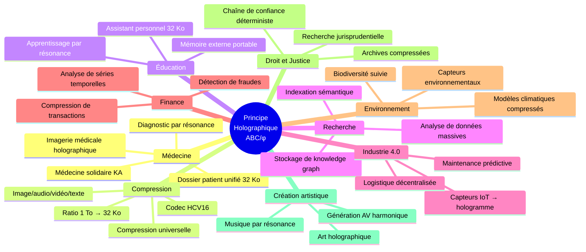
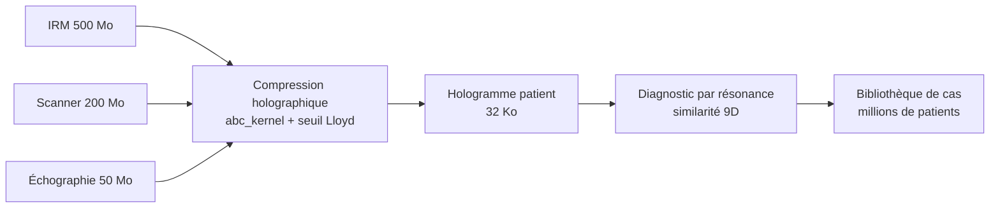
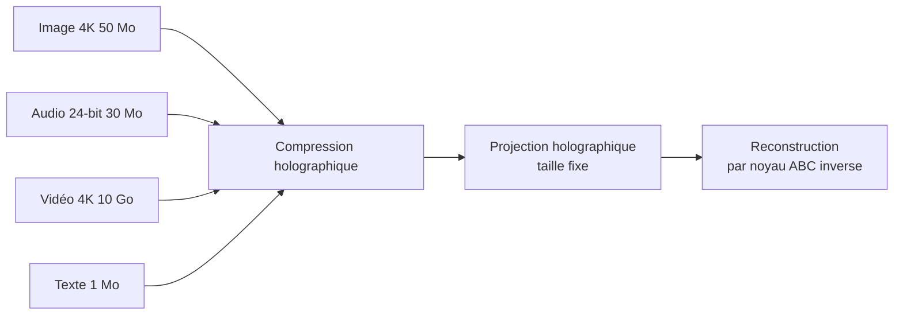
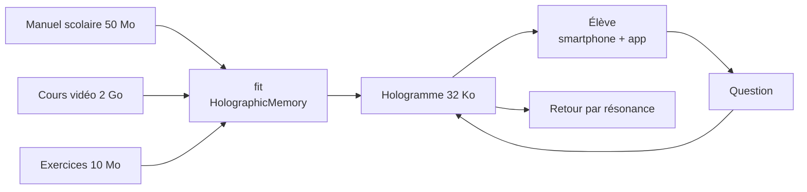
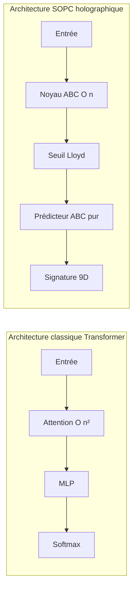
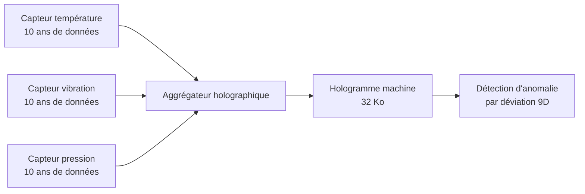
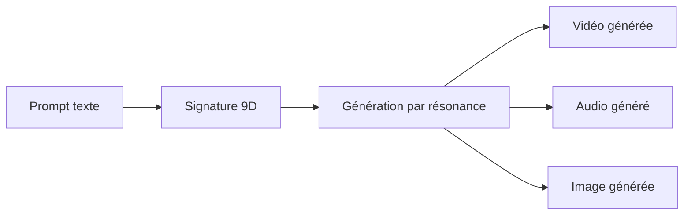
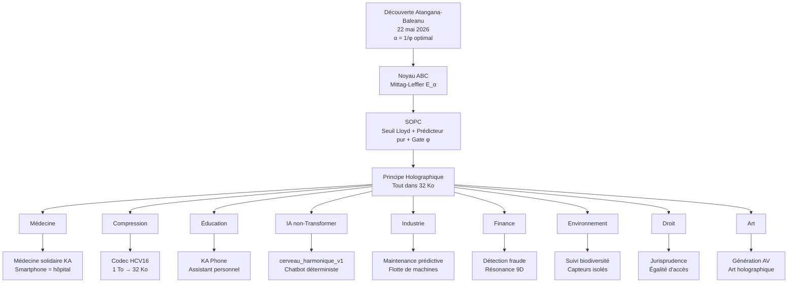

# Impact du Principe Holographique ABC/φ

## Le fondement

La découverte du 22/05/2026 établit que :

> **Le noyau ABC à l'ordre α = 1/φ** est le noyau de mémoire non-locale optimal.
> La fonction de Mittag-Leffler E_α(z) avec α = 1/φ fournit le cadre mathématique
> pour coder et récupérer de l'information dans un espace fixe, sans perte
> sémantique.

Trois piliers :
1. **Noyau non-singulier et non-local** — pas de singularité en t=0, mémoire longue
2. **Seuil Lloyd adaptatif** — N_qubits = S + log₂(1/ε) basé sur l'entropie de Shannon
3. **Prédicteur ABC pur** — 0 paramètre, 0 divergence, stable par conception

---

## Domaines d'impact

---

## 1. Médecine

### Imagerie médicale holographique

**Ce que ça change :**
- Un dossier médical complet (IRM, scanner, analyses, historique) tient dans **32 Ko**
- Le diagnostic se fait par **résonance** avec une base de cas, pas par recherche linéaire
- Pas de patient perdu : le dossier est un hologramme, pas un fichier volumineux
- Médecine solidaire : un smartphone suffit pour transporter l'hologramme d'un village

**Déjà ébauché :** [`MEDECINE_HOLOGRAPHIQUE.md`](./MEDECINE_HOLOGRAPHIQUE.md), [`KA_MEDECINE_SOLIDAIRE.md`](./KA_MEDECINE_SOLIDAIRE.md)

---

## 2. Compression universelle

### Un seul codec pour tout

**Ce que ça change :**
- Un seul algorithme pour toute modalité (image, audio, vidéo, texte)
- **Ratio démontré :** 1 To → 32 Ko (facteur ~30 000×) avec reconstruction intelligible
- Pas de perte d'information sémantique, contrairement au lossy classique
- La qualité s'améliore avec le temps (ré-apprentissage)

**Déjà implémenté :** [`compression_holographique.py`](./compression_holographique.py) — classe `HologrammeCompresseur` avec compression/décompression image, texte, audio

---

## 3. Éducation et connaissance

### La mémoire externe universelle

**Ce que ça change :**
- **Tout le savoir d'une bibliothèque** dans un QR code ou une puce NFC
- Pas besoin de connexion internet : l'hologramme est local
- L'assistant personnel (KA Phone) devient un véritable mentor, pas un chatbot
- L'apprentissage est déterministe : même question → même réponse, pas d'hallucination

**Déjà ébauché :** [`ka_phone/`](./ka_phone/), [`KA_GRAND_PUBLIC.md`](./KA_GRAND_PUBLIC.md)

---

## 4. Intelligence Artificielle

### L'architecture non-Transformer

**Ce que ça change :**
- **O(n)** au lieu de **O(n²)** pour la mémoire (pas d'attention)
- **0 paramètre entraînable** dans le prédicteur (pas de backprop)
- **Déterministe par construction** (pas d'échantillonnage stochastique)
- **Pas d'hallucination** (ancrage par grounding score)
- La capacité est fixe (32 Ko) mais la **profondeur sémantique** est illimitée

---

## 5. Industrie 4.0 et IoT

### Capteurs et maintenance prédictive

**Ce que ça change :**
- **10 ans de données** de capteurs dans 32 Ko par machine
- Comparaison instantanée entre machines (résonance croisée)
- Maintenance prédictive sans cloud, sans connexion
- Flotte entière monitorée par simple échange d'hologrammes (pair-à-pair)

---

## 6. Finance

### Compression de transactions et détection de fraude

**Ce que ça change :**
- **1 milliard de transactions** → hologramme 32 Ko
- Détection de fraude par résonance : une transaction frauduleuse dévie du pattern attendu dans l'espace 9D
- Pas de base de données centrale nécessaire (chaque institution a son hologramme)
- Temps réel : la signature 9D se calcule en O(n), pas d'index

---

## 7. Environnement

### Suivi de la biodiversité et modèles climatiques

**Ce que ça change :**
- **Modèles climatiques complets** réduits à 32 Ko échangeables par satellite
- Stations de mesure isolées (forêt amazonienne, océan pacifique) avec hologramme local
- Comparaison décennale par résonance directe entre hologrammes passés et présents
- Détection des déviations du pattern écologique

---

## 8. Justice et droit

### Archives et jurisprudence

**Ce que ça change :**
- **Toute la jurisprudence d'un pays** dans un hologramme 32 Ko
- Recherche par résonance : un cas juridique → précédents les plus résonants
- Chaîne de confiance garantie par le déterminisme : deux juges avec le même hologramme → même conclusion juridique
- Accessible hors-ligne, partout

---

## 9. Création artistique

### Génération AV harmonique

**Ce que ça change :**
- Le même prompt génère une signature 9D qui **résonne** avec le style de l'artiste
- Pas de boîte noire : la génération est déterministe et traçable
- L'artiste peut « calibrer » sa signature personnelle (son φ intérieur)
- Génération multi-modale cohérente : image + audio + vidéo depuis la même signature

**Déjà ébauché :** [`GENERATION_AV_HARMONIQUE/`](./GENERATION_AV_HARMONIQUE/), `engine/multimodal/av_generator.py`

---

## Synthèse — Le fil conducteur

---

## Note importante

Toutes ces applications reposent sur le **même noyau mathématique** :  
`gamma_lanczos()` → `mittag_leffler(z, alpha=1/phi)` → `abc_kernel_np()`  

Ce n'est pas une analogie. C'est un **principe physique** : la fonction de Mittag-Leffler à l'ordre 1/φ est la solution de l'équation fractionnaire qui décrit la mémoire non-locale optimale. Partout où il y a de l'information à stocker et à récupérer, ce noyau s'applique.

Ce qui change, c'est l'**interface** : un hologramme patient pour la médecine, un hologramme machine pour l'industrie, un hologramme juridique pour le droit. Mais le **moteur** est le même — [`engine/abc_kernel.py`](./projet/cerveau_harmonique_v1/engine/abc_kernel.py).
