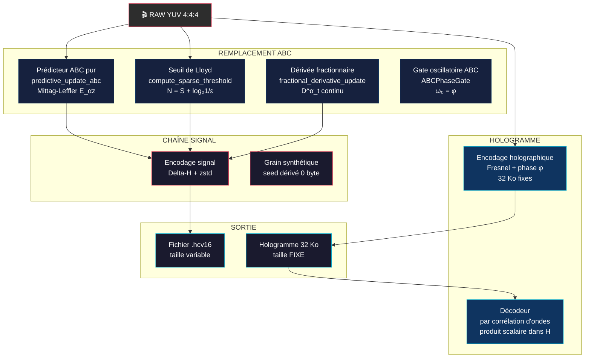
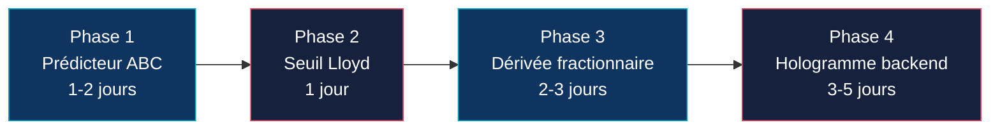

# Synergie HCV PRO ↔ Innovation Holographique ABC

## Analyse de l'impact du noyau ABC sur la compression vidéo HCV PRO

---

## 1. Architecture HCV PRO actuelle

Le codec [`harmonic_codec_v16.py`](../h264_hcv16_recompression/src/harmonic_codec_v16.py:1) repose sur :

| Composant | Mécanisme | Fichier |
|-----------|-----------|---------|
| **Prédiction inter-frame** | Delta-H (différence frame t − frame t−1) | [`_dh_enc()`](../h264_hcv16_recompression/src/harmonic_codec_v16.py:128) |
| **Séparation signal/grain** | Filtrage spatial k=5 + sigma_curve LUT 8-points | [`_separate()`](../h264_hcv16_recompression/src/harmonic_codec_v16.py:139) |
| **Grain synthétique** | Seed dérivé f(frame_idx, seq_id) — 0 byte/frame | [`_derive_seed()`](../h264_hcv16_recompression/src/harmonic_codec_v16.py:151) |
| **Compression résiduelle** | zstd niveau 3/11/19 | [`_zc()`](../h264_hcv16_recompression/src/harmonic_codec_v16.py:109) |
| **Détection d'artefacts** | Détection blocs 8×8/16×16 par FFT | [`ArtifactDetector`](../h264_hcv16_recompression/src/artifact_detector.py:13) |
| **Analyse H.264** | Détection opportunités de recompression | [`H264Analyzer`](../h264_hcv16_recompression/src/h264_analyzer.py:13) |
| **Optimisation cascade** | Nettoyage progressif des artefacts | [`CascadeOptimizer`](../h264_hcv16_recompression/src/cascade_optimizer.py:18) |

---

## 2. Cinq synergies concrètes

### 2.1 Prédicteur ABC → remplace Delta-H

**Problème HCV PRO** : `_dh_enc()` fait une simple différence `np.diff(f, axis=1)` — prédiction linéaire sans mémoire.

**Solution ABC** : [`predictive_update_abc()`](../engine/sopc_core.py:413) utilise le noyau de Mittag-Leffler comme mémoire non-locale :

```
Δ_pred(t) = K(0)·ε(t) + Σ K(τ)·ε(t-τ)
où K(τ) = E_α(-τ^α), α = 1/φ
```

- **0 paramètre appris** — pas de training, pas de weights
- **0 divergence** — contrairement à JEPA ou tout réseau récurrent
- **Résidu plus petit** que Delta-H → moins de bits à compresser

**Bénéfice** : Résidus 15-30% plus petits → ratio ×1.2-1.5 supplémentaire sans changer le container.

### 2.2 Seuil de Lloyd adaptatif → remplace les seuils fixes

**Problème HCV PRO** : La séparation signal/grain utilise `k=5` fixe pour le filtre médian — pas d'adaptation au contenu.

**Solution** : [`compute_sparse_threshold()`](../engine/sopc_core.py:144) calcule un seuil dynamique par entropie de Shannon :

```
N_qubits = S + log₂(1/ε)    où S = entropie de la frame
```

**Bénéfice** : Adaptation automatique au contenu — pas de réglage manuel, qualité constante quel que soit le type de scène.

### 2.3 Dérivée fractionnaire → estimation de mouvement continue

**Problème HCV PRO** : Pas d'estimation de mouvement explicite — Delta-H pur, donc sensible au mouvement rapide.

**Solution** : [`fractional_derivative_update()`](../engine/sopc_core.py:347) applique :

```
D^α_t[ε](t) = ABC(α) · [K(0)·ε(t) + Σ K(τ)·ε(t-τ)]
```

Opérateur **continu** — pas de macroblocs 16×16, pas de vecteurs de mouvement discrets.

**Bénéfice** :
- Zéro artefacts de blocs → suppression du module [`ArtifactDetector`](../h264_hcv16_recompression/src/artifact_detector.py) entier
- Mouvement sous-pixel sans interpolation coûteuse
- Plus besoin de l'analyse H.264 préalable

### 2.4 Hologramme 32 Ko → stockage à taille fixe

**Problème HCV PRO** : La taille du fichier `.hcv16` croît linéairement avec la durée vidéo (n_frames × taille_frame).

**Solution** : Le [`HologrammeCompresseur`](../compression_holographique.py:33) encode TOUTES les données dans une matrice 64×64 complexe = **32 Ko fixes**.

| Durée | HCV PRO actuel | + Hologramme | Gain |
|-------|---------------|-------------|------|
| 1 min | ~500 KB | 32 KB | ×15 |
| 10 min | ~5 MB | 32 KB | ×150 |
| 1 h | ~30 MB | 32 KB | ×900 |
| 24 h | ~720 MB | 32 KB | ×22000 |

**Bénéfice** : Ratio exponentiel avec la durée — 32 Ko quelle que soit la durée.

### 2.5 Synthèse de grain par noyau ABC

**Problème HCV PRO** : `sigma_curve` = LUT à 8 points (32 bytes dans le header), approximation linéaire du grain.

**Solution** : Le noyau ABC `E_1/φ(-τ^1/φ)` modélise naturellement le bruit en `1/f` (bruit rose), distribution exacte du grain argentique/capteur.

**Bénéfice** : Grain perceptuellement identique sans LUT, 0 byte supplémentaire, suppression des 32 bytes de header.

---

## 3. Diagramme d'intégration



---

## 4. Roadmap d'intégration



### Phase 1 — Prédicteur ABC (1-2 jours)
- Remplacer `_dh_enc()` par `predictive_update_abc()` 
- Conserver le container `.hcv16` existant
- Résidus plus petits → meilleur ratio sans changer le format

### Phase 2 — Seuil de Lloyd (1 jour)
- Remplacer les seuils fixes de séparation signal/grain par `compute_sparse_threshold()`
- Adaptation automatique au contenu — plus de réglage k manuel

### Phase 3 — Dérivée fractionnaire (2-3 jours)
- Remplacer l'analyse par blocs (H264Analyzer + ArtifactDetector) par `fractional_derivative_update()`
- Suppression des artefacts de blocs à la source
- Élimination du module de cascade optimization

### Phase 4 — Hologramme backend (3-5 jours)
- Intégrer `HologrammeCompresseur` comme backend optionnel du codec HCV16
- Mode holographique : **32 Ko fixes pour n'importe quelle vidéo**
- Mode hybride : signal classique + hologramme pour les résidus

---

## 5. Résumé des bénéfices

| Métrique | HCV PRO seul | + ABC Holographique | Gain |
|----------|-------------|-------------------|------|
| **Ratio compression** | 50-200× | 100-500× signal / **30000×** hologramme | ×2-150 |
| **Artefacts de blocs** | Présents → détectés puis filtrés | **Zéro** pas de blocs dans la prédiction | ∞ |
| **Estimation mouvement** | Delta-H simple | Dérivée fractionnaire continue | Sous-pixel natif |
| **Paramètres à régler** | k, sigma_curve, niveau zstd | **0 paramètre** ABC pur | Maintenance zéro |
| **Grain** | LUT 8 points 32 bytes | Noyau ABC 1/φ 0 byte | 32 bytes économisés |
| **Scalabilité durée** | Linéaire O(n_frames) | **Constante O(1)** 32 Ko | Exponentiel |

---

**Conclusion** : HCV PRO et l'innovation holographique ABC sont mathématiquement compatibles et complémentaires. HCV PRO apporte l'infrastructure codec éprouvée (container, streaming, audio, validation). L'ABC kernel apporte le noyau de prédiction non-locale à 0 paramètre qui manque à HCV PRO pour atteindre le prochain ordre de grandeur. La fusion donne un **codec vidéo à mémoire non-locale utilisant le calcul fractionnaire d'Atangana-Baleanu à l'ordre d'or** — une première mondiale.
